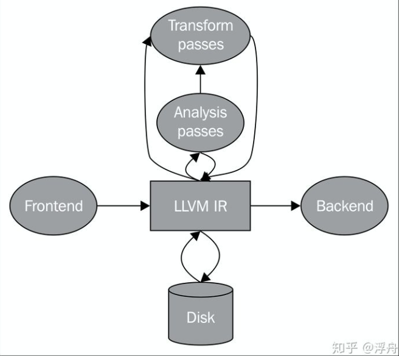
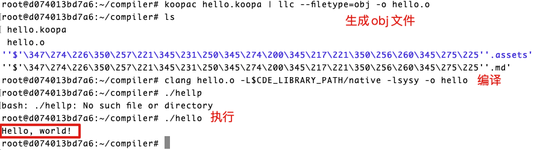
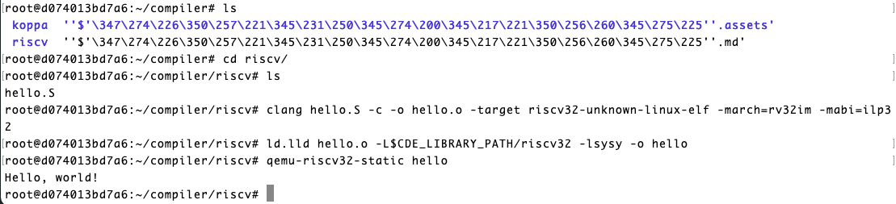
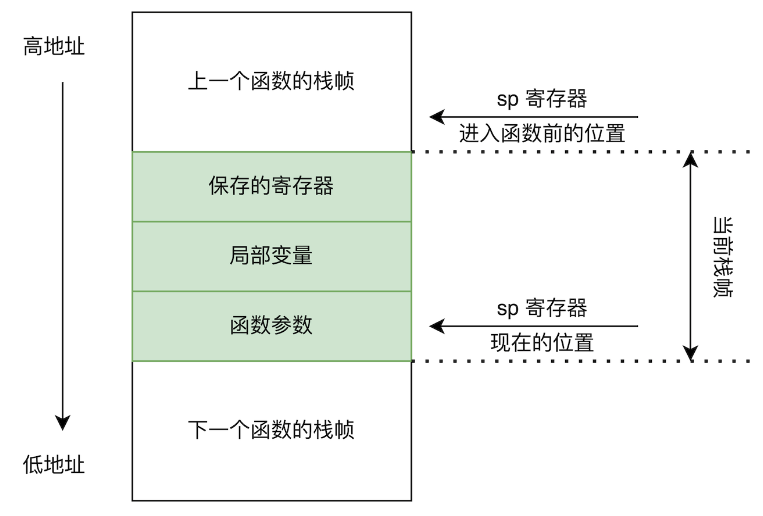
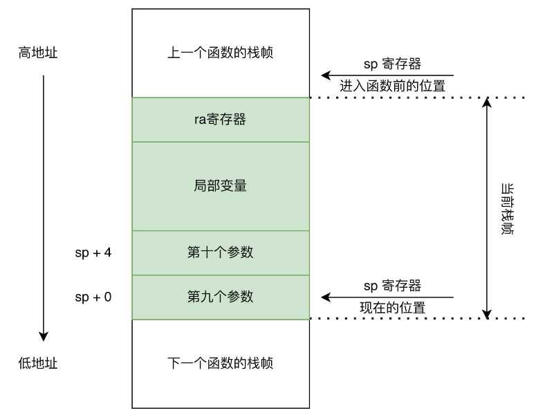

# 编译器开发记录

> by 王元淳 2019300099
>
> @NWPU chang'an April.25th - June
>
> 参考https://pku-minic.github.io/online-doc/

Koopa IR规范：https://pku-minic.github.io/online-doc/#/misc-app-ref/koopa

RISC-V指令速查：https://pku-minic.github.io/online-doc/#/misc-app-ref/riscv-insts

## 1. 利用docker配置测试环境

Dockerfile:

https://hub.docker.com/layers/compiler-dev/maxxing/compiler-dev/latest/images/sha256-0dd7ee039b8db8e3ba67f23f144e885dc11962aa02ce970c16c13d6be1f15c7c?context=explore

此镜像中提供了RISC-V的测试环境

容器使用方式：

一次性方式：

```
docker run --rm maxxing/compiler-dev ls -l /
```

执行方式：(采用软连接指定可以实现让容器访问宿主机的文件)

```
docker run -it --rm -v /Users/frederickwang/Desktop/projects/compiler/compiler2022:/root/compiler maxxing/compiler-dev bash
```

## 2. IR选择（Koopa IR）

Koopa IR 是一种专为北京大学编译原理课程实践设计的教学用的中间表示 (IR), 它在设计上**类似 LLVM IR, 但简化了很多内容**, 方便大家上手和理解.

Koopa IR 是一种强类型的 IR, IR 中的所有值 (`Value`) 和函数 (`Function`) 都具备类型 (`Type`). 这种设计避免了一些 IR 定义上的模糊之处, 例如之前的教学用 IR 完全不区分整数变量和数组变量, 很容易出现混淆; 同时可以在生成 IR 之前就确定 IR 中存在的部分问题, 例如将任意整数作为内存地址并向其中存储数据.

Koopa IR 中, 基本块 (basic block) 必须是显式定义的. 即, 在描述函数内的指令时, 你必须把指令按照基本块分组, 每个基本块结尾的指令只能是分支/跳转/函数返回指令之一. 在 IR 的数据结构表示上, 指令也会被按照基本块分类. 这很大程度上方便了 IR 的优化, 因为许多优化算法都是在基本块的基础上对程序进行分析/变换的.

Koopa IR 还是一种 SSA 形式的 IR. 虽然这部分内容在课程实践中并非必须掌握, 但考虑到有些同学可能希望在课程实践的要求上, 做出一个更完备, 更强大的编译器, 我们将 Koopa IR 设计成了同时兼容非 SSA 形式和 SSA 形式的样子. 基于 SSA 形式下的 Koopa IR, 你可以开展更多复杂且有效的编译优化.

### LLVM IR：

LLVM：Low-Level Virtual Machine。LLVM项目本意是创建一个虚拟机。创建过程中，创立一个编译高效，占用资源较少的编译平台。从此LLVM代表了编译平台的含义。


LLVM IR 的含义就是针对LLVM平台开发的IR：



LLVM IR有三种形式：

- 内存中的表示形式，如BasicBlock，Instruction这种cpp类；
- bitcode形式，这是一种序列化的二进制表示形式；
- LLVM汇编文件形式，这也是一种序列化的表示形式，与bitcode的区别是汇编文件是可读的、字符串的形式。

详细介绍：https://zhuanlan.zhihu.com/p/200613850

### SSA形式IR：

> In compiler design, static single assignment form (often abbreviated as SSA form or simply SSA) is a property of an intermediate representation (IR), which requires that each variable is assigned exactly once, and every variable is defined before it is used.

SSA 通过简化程序中变量的特性，可以同时达到两种目的：第一，可以简化很多编译优化方法的过程；第二，对很多编译优化方法来说，可以获得更好的优化结果。下面给出一个例子：

```
 y := 1
 y := 2
 x := y
```

SSA形式：

```
 y1 := 1
 y2 := 2
 x1 := y2
```

### Koopa IR执行实例

源码

```objc
// SysY 中的 `putch` 函数的声明.
decl @putch(i32)

// 一个用来输出字符串 (其实是整数数组) 的函数.
// 函数会扫描输入的数组, 将数组中的整数视作 ASCII 码, 并作为字符输出到屏幕上,
// 遇到 0 时停止扫描.
fun @putstr(@arr: *i32) {
%entry:
  jump %loop_entry(@arr)

// Koopa IR 采用基本块参数代替 SSA 形式中的 Phi 函数.
// 当然这部分内容并不在实践要求的必选内容之中, 你无需过分关注.
%loop_entry(%ptr: *i32):
  %cur = load %ptr
  br %cur, %loop_body, %end

%loop_body:
  call @putch(%cur)
  %next = getptr %ptr, 1
  jump %loop_entry(%next)

%end:
  ret
}

// 字符串 "Hello, world!\n\0".
global @str = alloc [i32, 15], {
  72, 101, 108, 108, 111, 44, 32, 119, 111, 114, 108, 100, 33, 10, 0
}

// `main` 函数, 程序的入口.
fun @main(): i32 {
%entry:
  %str = getelemptr @str, 0
  call @putstr(%str)
  ret 0
}

```




## 3. RISC-V

RISC-V, 读作 “risk-five”, 是由加州大学伯克利分校设计并推广的第五代 RISC 指令系统体系结构 (ISA). RISC-V 没有任何历史包袱, 设计简洁, 高效低能耗, 且高度模块化——最主要的, 它还是一款完全开源的 ISA.

RISC-V 的指令系统由基础指令系统 (base instruction set) 和指令系统扩展 (extension) 构成. 每个 RISC-V 处理器必须实现基础指令系统, 同时可以支持若干扩展. 常用的基础指令系统有两种:

- `RV32I`: 32 位整数指令系统.
- `RV64I`: 64 位整数指令系统. 兼容 `RV32I`.

常用的标准指令系统扩展包括:

- `M` 扩展: 包括乘法和除法相关的指令.
- `A` 扩展: 包括原子内存操作相关的指令.
- `F` 扩展: 包括单精度浮点操作相关的指令.
- `D` 扩展: 包括双精度浮点操作相关的指令.
- `C` 扩展: 包括常用指令的 16 位宽度的压缩版本.

我们通常使用 `RV32/64I` + 扩展名称的方式来描述某个处理器/平台支持的 RISC-V 指令系统类型, 例如 `RV32IMA` 代表这个处理器是一个 32 位的, 支持 `M` 和 `A` 扩展的 RISC-V 处理器.

### RISC-V文件编译执行：

源码：

```objc
  # 代码段.
  .text
  # `main` 函数, 程序的入口.
  .globl main
main:
  addi  sp, sp, -16
  sw    ra, 12(sp)
  sw    s0, 8(sp)
  sw    s1, 4(sp)
  la    s0, hello_str
  li    s1, 0
1:
  add   a0, s0, s1
  lbu   a0, 0(a0)
  beqz  a0, 1f
  call  putch
  addi  s1, s1, 1
  j     1b
1:
  li    a0, 0
  lw    s1, 4(sp)
  lw    s0, 8(sp)
  lw    ra, 12(sp)
  addi  sp, sp, 16
  ret

  # 数据段.
  .data
  # 字符串 "Hello, world!\n\0".
hello_str:
  .asciz "Hello, world!\n"

```



## 4. lv1: main函数处理

编译器把源代码变成可执行文件的过程 (通常) 又分为:

1. **编译:** 将源代码编译为汇编代码 (assembly).
2. **汇编:** 将汇编代码汇编为目标文件 (object file).
3. **链接:** 将目标文件链接为可执行文件 (execuatble).

我只涉及上述的第一点内容. 也就是, 我们只需要设计一个程序, 将输入的 SysY 源代码, 编译到 RISC-V 汇编即可. 在这种意义之下, 编译器通常由以下几个部分组成:

- **前端:** 通过词法分析和语法分析, 将源代码解析成抽象语法树 (abstract syntax tree, AST). 通过语义分析, 扫描抽象语法树, 检查其是否存在语义错误.
- **中端:** 将抽象语法树转换为中间表示 (intermediate representation, IR), 并在此基础上完成一些机器无关优化.
- **后端:** 将中间表示转换为目标平台的汇编代码, 并在此基础上完成一些机器相关优化.

### 编译器结构

源代码：

```c
int main() {
  // 我是注释诶嘿嘿
  return 0;
}
```

#### 词法分析器lexer

词法分析的作用, 是把字节流转换为单词流 (token stream). 词法分析器 (lexer) 会按照某种规则读取文件, 并将文件的内容拆分成一个个 token 作为输出, 传递给语法分析器 (parser). 同时, lexer 还会忽略文件里的一些无意义的内容, 比如**空格, 换行符和注释**.Lexer 生成的 token 会包含一些信息, 用来让 parser 区分 token 的种类, 以及在必要时获取 token 的内容.

1. **种类:** 关键字, **内容:** `int`.
2. **种类:** 标识符, **内容:** `main`.
3. **种类:** 其他字符, **内容:** `(`.
4. **种类:** 其他字符, **内容:** `)`.
5. **种类:** 其他字符, **内容:** `{`.
6. **种类:** 关键字, **内容:** `return`.
7. **种类:** 整数字面量, **内容:** `0`.
8. **种类:** 其他字符, **内容:** `;`.
9. **种类:** 其他字符, **内容:** `}`.

#### 语法分析器parser

Lexer 生成的 token 会包含一些信息, 用来让 parser 区分 token 的种类, 以及在必要时获取 token 的内容.

生成AST：

```c
CompUnit {
  items: [
    FuncDef {
      type: "int",
      name: "main",
      params: [],
      body: Block {
        stmts: [
          Return {
            value: 0
          }
        ]
      }
    }
  ]
}
```

#### 语义分析

语义分析阶段, 编译器通常会依据语义约束:

- **建立符号表**, 跟踪程序里变量的声明和使用, 确定程序在某处用到了哪一个变量, 同时也可发现变量重复定义/引用未定义变量之类的错误.
- **进行类型检查**, 确定程序中是否存在诸如 “对整数变量进行数组访问” 这种类型问题. 同时标注程序中表达式的类型, 以便进行后续的生成工作. 对于某些编程语言 (例如 C++11 之后的 C++, Rust 等等), 编译器还会进行类型推断.
- **进行必要的编译期计算**. SysY 中支持使用常量表达式作为数组定义时的长度, 而我们在生成 IR 之前, 必须知道数组的长度 (SysY 不支持 [VLA](https://en.wikipedia.org/wiki/Variable-length_array)), 这就要求编译器必须能在编译的时候算出常量表达式的值, 同时对那些无法计算的常量表达式报错. 对于某些支持元编程的语言, 这一步可能会非常复杂.

至此, 就能得到一个语法正确, 语义清晰的 AST 表示了.

#### IR生成

编译器通常不会直接通过扫描 AST 来生成目标代码 (汇编)——当然这么做也不是不可以, 因为从定义上讲, AST 也是一种 “中间表示”. 只不过, AST 在形式上更接近源语言, 而且其中可能会包含一些更为高级的语义, 例如分支/循环, 甚至结构体/类等等, 这些内容要一步到位变成汇编还是比较复杂的.

所以, 编译器通常会将 AST 转换为另一种形式的数据结构, 我们把它称作 IR. IR 的抽象层次比 AST 更低, 但又不至于低到汇编代码的程度. 在此基础上, 无论是直接把 IR 进一步转换为汇编代码, 还是在 IR 之上做出一些优化, 都相对更容易.

有了 IR 的存在, 我们也可以大幅降低编译器的开发成本: 假设我们想开发 MM 种语言的编译器, 要求它们能把输入编译成 NN 种指令系统的目标代码, 在没有统一的 IR 的情况下, 我们需要开发 M \times NM×N 个相关模块. 如果我们先把所有源语言都转换到同一种 IR, 然后再将这种 IR 翻译为不同的目标代码, 我们就只需要开发 M + NM+N 个相关模块.

现实世界的确存在这样的操作, 例如 [LLVM IR](https://llvm.org/docs/) 就是一种被广泛使用的 IR. 有很多语言的编译器实现, 例如 Rust, Swift, Julia, 都会将源语言翻译到 LLVM IR. 同时, LLVM IR 可被生成为 x86, ARM, RISC-V 等一系列指令系统的目标代码. 此时, 编译器的前后端是完全解耦的, 两部分可以各自维护, 十分方便.

此外, IR 也可以极大地方便开发者调试自己的编译器. 在编译实践中, 你的编译器对于同一个 SysY 文件的输入, 既可以输出 Koopa IR, 也可以输出 RISC-V. 你可以借助相关测试工具来测试这两部分的正确性, 进而定位你的编译器到底是在前端/中端部分出了问题, 还是在后端的部分出了问题.

当然, 和 token, AST 等数据结构一样, IR 作为编译器内部的一种表示, 其形式也并不是唯一的. 

#### 目标代码生成

编译器进行的最后一步操作, 就是将 IR 转换为目标代码, 也就是目标指令系统的汇编代码. 通常情况下, 这一步通常要做以下几件事:

1. **指令选择:** 决定 IR 中的指令应该被翻译为哪些目标指令系统的指令. 例如前文的 Koopa IR 程序中出现的 `lt` 指令可以被翻译为 RISC-V 中的 `slt`/`slti` 指令.
2. **寄存器分配:** 决定 IR 中的值和指令系统中寄存器的对应关系. 例如前文的 Koopa IR 程序中的 `@x`, `%cond`, `%0` 等等, 它们最终可能会被放在 RISC-V 的某些寄存器中. 由于指令系统中寄存器的数量通常是有限的 (RISC-V 中只有 32 个整数通用寄存器, 且它们并不都能用来存放数据), 某些值还可能会被分配在内存中.
3. **指令调度:** 决定 IR 生成的指令序列最终的顺序如何. 我们通常希望编译器能生成一个最优化的指令序列, 它可以最大程度地利用目标平台的微结构特性, 这样生成的程序的性能就会很高. 例如编译器可能会穿插调度访存指令和其他指令, 以求减少访存导致的停顿.

### 简单编译器实现

#### BENF

EBNF, 即 [Extended Backus–Naur Form](https://en.wikipedia.org/wiki/Extended_Backus–Naur_form), 扩展巴科斯范式, 可以用来描述编程语言的语法. 基于 SysY 的 EBNF, 我们可以从开始符号出发, 推导出任何一个符合 SysY 语法定义的 SysY 程序. 那么, 如何从上述的 EBNF 推导出示例的 SysY 程序呢?

我们不难注意到, EBNF 由若干条形如 `A ::= B;` 的规则构成. 这种规则告诉我们, 当我们遇到一个 `A` 时, 我们可以把 `A` 代换成 `B`, 这就完成了一次推导. 这其中, `A` 被称为非终结符, 因为它可以推导出其他的符号.

#### 开发模版

makefile模版https://github.com/pku-minic/sysy-make-template

#### sysy.l和sysy.y

在模板的 `src` 目录中新建两个文件: `sysy.l` 和 `sysy.y`, 前者将会描述**词法规则**并被 Flex 读取, 后者将会描述**语法规则**并被 Bison 读取. 由于 Flex 和 Bison 生成的 lexer 和 parser 会互相调用, 所以这两个文件里的内容也相互依赖.

`.l`/`.y` 文件有一些共同点, 比如它们的结构都是:

```cpp
// 这里写一些选项, 可以控制 Flex/Bison 的某些行为

%{

// 这里写一些全局的代码
// 因为最后要生成 C/C++ 文件, 实现主要逻辑的部分都是用 C/C++ 写的
// 难免会用到头文件, 所以通常  头文件和一些全局声明/定义  写在这里

%}

// 这里写一些 Flex/Bison 相关的  定义
// 对于 Flex, 这里可以定义某个符号对应的正则表达式
// 对于 Bison, 这里可以定义终结符/非终结符的类型

%%

// 这里写 Flex/Bison 的  规则描述
// 对于 Flex, 这里写的是 lexer 扫描到某个 token 后做的操作
// 对于 Bison, 这里写的是 parser 遇到某种语法规则后做的操作

%%

// 这里写一些用户  自定义的代码
// 比如你希望在生成的 C/C++ 文件里定义一个函数, 做一些辅助工作
// 你同时希望在之前的规则描述里调用你定义的函数
// 那么, 你可以把 C/C++ 的函数定义写在这里, 声明写在文件开头
```

在目录中利用MakeFile进行编译：

```makefile
# Based on https://matansilver.com/2017/08/29/universal-makefile/
# Modified by MaxXing

# Settings
# Set to 0 to enable C mode
CPP_MODE := 1
ifeq ($(CPP_MODE), 0)
FB_EXT := .c
else
FB_EXT := .cpp
endif

# Flags
CFLAGS := -Wall -std=c11
CXXFLAGS := -Wall -Wno-register -std=c++17
FFLAGS :=
BFLAGS := -d
LDFLAGS :=

# Debug flags
DEBUG ?= 1
ifeq ($(DEBUG), 0)
CFLAGS += -O2
CXXFLAGS += -O2
else
CFLAGS += -g -O0
CXXFLAGS += -g -O0
endif

# Compilers
CC := clang
CXX := clang++
FLEX := flex
BISON := bison

# Directories
TOP_DIR := $(shell pwd)
TARGET_EXEC := compiler
SRC_DIR := $(TOP_DIR)/src
BUILD_DIR ?= $(TOP_DIR)/build
LIB_DIR ?= $(CDE_LIBRARY_PATH)/native
INC_DIR ?= $(CDE_INCLUDE_PATH)
CFLAGS += -I$(INC_DIR)
CXXFLAGS += -I$(INC_DIR)
LDFLAGS += -L$(LIB_DIR) -lkoopa

# Source files & target files
FB_SRCS := $(patsubst $(SRC_DIR)/%.l, $(BUILD_DIR)/%.lex$(FB_EXT), $(shell find $(SRC_DIR) -name "*.l"))
FB_SRCS += $(patsubst $(SRC_DIR)/%.y, $(BUILD_DIR)/%.tab$(FB_EXT), $(shell find $(SRC_DIR) -name "*.y"))
SRCS := $(FB_SRCS) $(shell find $(SRC_DIR) -name "*.c" -or -name "*.cpp" -or -name "*.cc")
OBJS := $(patsubst $(SRC_DIR)/%.c, $(BUILD_DIR)/%.c.o, $(SRCS))
OBJS := $(patsubst $(SRC_DIR)/%.cpp, $(BUILD_DIR)/%.cpp.o, $(OBJS))
OBJS := $(patsubst $(SRC_DIR)/%.cc, $(BUILD_DIR)/%.cc.o, $(OBJS))
OBJS := $(patsubst $(BUILD_DIR)/%.c, $(BUILD_DIR)/%.c.o, $(OBJS))
OBJS := $(patsubst $(BUILD_DIR)/%.cpp, $(BUILD_DIR)/%.cpp.o, $(OBJS))
OBJS := $(patsubst $(BUILD_DIR)/%.cc, $(BUILD_DIR)/%.cc.o, $(OBJS))

# Header directories & dependencies
INC_DIRS := $(shell find $(SRC_DIR) -type d)
INC_DIRS += $(INC_DIRS:$(SRC_DIR)%=$(BUILD_DIR)%)
INC_FLAGS := $(addprefix -I, $(INC_DIRS))
DEPS := $(OBJS:.o=.d)
CPPFLAGS = $(INC_FLAGS) -MMD -MP


# Main target
$(BUILD_DIR)/$(TARGET_EXEC): $(FB_SRCS) $(OBJS)
	$(CXX) $(OBJS) $(LDFLAGS) -lpthread -ldl -o $@

# C source
define c_recipe
	mkdir -p $(dir $@)
	$(CC) $(CPPFLAGS) $(CFLAGS) -c $< -o $@
endef
$(BUILD_DIR)/%.c.o: $(SRC_DIR)/%.c; $(c_recipe)
$(BUILD_DIR)/%.c.o: $(BUILD_DIR)/%.c; $(c_recipe)

# C++ source
define cxx_recipe
	mkdir -p $(dir $@)
	$(CXX) $(CPPFLAGS) $(CXXFLAGS) -c $< -o $@
endef
$(BUILD_DIR)/%.cpp.o: $(SRC_DIR)/%.cpp; $(cxx_recipe)
$(BUILD_DIR)/%.cpp.o: $(BUILD_DIR)/%.cpp; $(cxx_recipe)
$(BUILD_DIR)/%.cc.o: $(SRC_DIR)/%.cc; $(cxx_recipe)

# Flex
$(BUILD_DIR)/%.lex$(FB_EXT): $(SRC_DIR)/%.l
	mkdir -p $(dir $@)
	$(FLEX) $(FFLAGS) -o $@ $<

# Bison
$(BUILD_DIR)/%.tab$(FB_EXT): $(SRC_DIR)/%.y
	mkdir -p $(dir $@)
	$(BISON) $(BFLAGS) -o $@ $<


.PHONY: clean

clean:
	-rm -rf $(BUILD_DIR)

-include $(DEPS)

```

执行结果：（单纯返回源程序中的字符串）


#### AST

标准的AST的一个实例：

```
CompUnit {
    func_def: FuncDef {
        func_type: Int,
        ident: "main",
        block: Block {
            stmt: Stmt {
                num: 0,
            },
        },
    },
}
```

前端通过词法分析和语法分析, 将源代码解析成抽象语法树 (abstract syntax tree, AST)，通过语义分析，扫描AST，检查是否存在语义错误。

1. AST 保留了程序语法的结构.
2. AST 是为了方便程序的处理而存在的, 不存在什么设计规范.

AST 需要保留一些必要的语法结构. 或者换句话说, EBNF 长什么样, AST 就可以长什么样. 比如本章需要大家处理的 EBNF 如下:

```bison
CompUnit  ::= FuncDef;

FuncDef   ::= FuncType IDENT "(" ")" Block;
FuncType  ::= "int";

Block     ::= "{" Stmt "}";
Stmt      ::= "return" Number ";";
Number    ::= INT_CONST;

```

那么bison的设计就应该是：

```cpp
struct CompUnit {
  FuncDef func_def;
};

struct FuncDef {
  FuncType func_type;
  std::string ident;
  Block block;
};

```

用面向对象以及智能指针来优化：

```cpp
// 所有 AST 的基类
class BaseAST {
 public:
  virtual ~BaseAST() = default;
};

// CompUnit 是 BaseAST
class CompUnitAST : public BaseAST {
 public:
  // 用智能指针管理对象
  std::unique_ptr<BaseAST> func_def;
};

// FuncDef 也是 BaseAST
class FuncDefAST : public BaseAST {
 public:
  std::unique_ptr<BaseAST> func_type;
  std::string ident;
  std::unique_ptr<BaseAST> block;
};

// ...

```

#### Koopa IR基础

结构：

Koopa IR 中, 最大的单位是 `Program`, 它代表一个 Koopa IR 程序. `Program` 由若干全局变量 (`Value`) 和函数 (`Function`) 构成. `Function` 又由若干基本块 (`BasicBlock`) 构成, 基本块中是一系列指令, 指令也是 `Value`. 所以 Koopa IR 程序的结构如下所示:

```
Program
	全局变量列表:
		Value 1.
		Value 2.
		…
	函数列表:
		Function 1.
			基本块列表:
				BasicBlock 1.
					指令列表:
            Value 1.
            Value 2.
						…
				BasicBlock 2.
				…
		Function 2.
		…
```

#### 基本块

基本块 ([basic block](https://en.wikipedia.org/wiki/Basic_block)) 是编译领域的一个很常见的概念, 它指的是一系列指令的集合, 基本块满足:

- **只有一个入口点:** 所有基本块中的指令如果要执行跳转, 只能跳到某个基本块的开头, 而不能跳到中间.
- **只有一个出口点:** 基本块中, 只有最后一条指令能进行控制流的转移, 也就是跳到其他基本块, 或者从函数中返回 (执行 `return` 操作).

基本块的存在可以简化很多编译过程中需要进行的分析, 所以 Koopa IR 要求函数中的指令必须预先按照基本块分类. 同时, Koopa IR 约定, 函数的第一个基本块为函数的入口基本块, 也就是执行函数时, 首先会执行第一个基本块中的指令.

现阶段, 我们可以暂时忽略全局变量, 同时我们也可以暂时认为, `Program` 的函数列表里只有一个 `Function`, `Function` 的基本块列表里只有一个 `BasicBlock` (也就是入口基本块).

接下来, 基本块中必须存在指令, 也就是 `Value`. Koopa IR 中主要有以下几种 `Value` (详见 [`ValueKind` 的文档](https://docs.rs/koopa/latest/koopa/ir/entities/enum.ValueKind.html)):

- **各类常量:** 整数常量 (`Integer`), 零初始化器 (`ZeroInit`), 等等.
- **参数引用:** 函数参数引用 (`FuncArgRef`) 等, 用来指代传入的参数.
- **内存分配:** 全局内存分配 (`GlobalAlloc`, 所有的全局变量都是这个玩意) 和局部内存分配 (`Alloc`).
- **访存指令:** 加载 (`Load`) 和存储 (`Store`).
- **指针运算:** `GetPtr` 和 `GetElemPtr`.
- **二元运算:** `Binary`, 比如加减乘除模/比较之类的运算都属于此类.
- **控制转移:** 条件分支 (`Branch`) 和无条件跳转 (`Jump`).
- **函数相关:** 函数调用 (`Call`) 和函数返回 (`Return`).

#### Koopa IR 生成思路

有以下几种生成 IR 的思路:

- 遍历 AST, 输出文本形式的 IR. 这样最简单, 适用于任何语言实现的编译器.
- 调用 Koopa IR 框架提供的接口. 使用 Rust 的同学可以尝试, 详见 Koopa IR 框架的 [crates.io](https://crates.io/crates/koopa) 以及[文档](https://docs.rs/koopa).
- 像定义 AST 一样定义表示 Koopa IR 的数据结构 (比如指令/基本块/函数等等), 然后遍历 AST 输出这种结构, 再遍历这种结构输出字符串.
- 对于使用 C/C++ 的同学, 在上一条的基础上, 你可以考虑把这种结构转换成 raw program, 然后使用 `libkoopa` 中的相关接口, 将 raw program 转换成其他形式的 Koopa IR 程序.

#### Koopa IR实现

koopa.h

```h
#ifndef LIBKOOPA_KOOPA_H_
#define LIBKOOPA_KOOPA_H_

#include <stddef.h>
#include <stdint.h>
#if defined(_WIN32) || defined(_WIN64)
#define KOOPA_OS_WINDOWS
#include <Windows.h>
#endif

#ifdef __cplusplus
extern "C"
{
#endif // __cplusplus

    ///
    /// Error code of some Koopa functions.
    ///
    enum koopa_error_code
    {
        /// No errors occurred.
        KOOPA_EC_SUCCESS = 0,
        /// UTF-8 string conversion error.
        KOOPA_EC_INVALID_UTF8_STRING,
        /// File operation error.
        KOOPA_EC_INVALID_FILE,
        /// Koopa IR program parsing error.
        KOOPA_EC_INVALID_KOOPA_PROGRAM,
        /// IO operation error.
        KOOPA_EC_IO_ERROR,
        /// Byte array to C string conversion error.
        KOOPA_EC_NULL_BYTE_ERROR,
        /// Insufficient buffer length.
        KOOPA_EC_INSUFFICIENT_BUFFER_LENGTH,
        /// Mismatch of item kind in raw slice.
        KOOPA_EC_RAW_SLICE_ITEM_KIND_MISMATCH,
        /// Passing null pointers to `libkoopa`.
        KOOPA_EC_NULL_POINTER_ERROR,
        /// Mismatch of type.
        KOOPA_EC_TYPE_MISMATCH,
        /// Mismatch of function parameter number.
        KOOPA_EC_FUNC_PARAM_NUM_MISMATCH,
    };

    ///
    /// Type of error code.
    ///
    typedef int32_t koopa_error_code_t;

///
/// Raw file (file descriptor or handle).
///
#ifdef KOOPA_OS_WINDOWS
    typedef HANDLE koopa_raw_file_t;
#else
typedef int koopa_raw_file_t;
#endif

    ///
    /// Koopa IR program.
    ///
    typedef const void *koopa_program_t;

    ///
    /// Raw program builder.
    ///
    typedef void *koopa_raw_program_builder_t;

    ///
    /// Kind of raw slice item.
    ///
    enum koopa_raw_slice_item_kind
    {
        /// Unknown.
        KOOPA_RSIK_UNKNOWN = 0,
        /// Type.
        KOOPA_RSIK_TYPE,
        /// Function.
        KOOPA_RSIK_FUNCTION,
        /// Basic block.
        KOOPA_RSIK_BASIC_BLOCK,
        /// Value.
        KOOPA_RSIK_VALUE,
    };

    ///
    /// Type of raw slice item kind.
    ///
    typedef uint32_t koopa_raw_slice_item_kind_t;

    ///
    /// A raw slice that can store any kind of items.
    ///
    typedef struct
    {
        /// Buffer of slice items.
        const void **buffer;
        /// Length of slice.
        uint32_t len;
        /// Kind of slice items.
        koopa_raw_slice_item_kind_t kind;
    } koopa_raw_slice_t;

    ///
    /// Tag of raw Koopa type.
    ///
    typedef enum
    {
        /// 32-bit integer.
        KOOPA_RTT_INT32,
        /// Unit (void).
        KOOPA_RTT_UNIT,
        /// Array (with base type and length).
        KOOPA_RTT_ARRAY,
        /// Pointer (with base type).
        KOOPA_RTT_POINTER,
        /// Function (with parameter types and return type).
        KOOPA_RTT_FUNCTION,
    } koopa_raw_type_tag_t;

    ///
    /// Kind of raw Koopa type.
    ///
    typedef struct koopa_raw_type_kind
    {
        koopa_raw_type_tag_t tag;
        union
        {
            struct
            {
                const struct koopa_raw_type_kind *base;
                size_t len;
            } array;
            struct
            {
                const struct koopa_raw_type_kind *base;
            } pointer;
            struct
            {
                koopa_raw_slice_t params;
                const struct koopa_raw_type_kind *ret;
            } function;
        } data;
    } koopa_raw_type_kind_t;

    ///
    /// A raw Koopa type.
    ///
    typedef const koopa_raw_type_kind_t *koopa_raw_type_t;

    ///
    /// A raw Koopa program.
    ///
    typedef struct
    {
        /// Global values (global allocations only).
        koopa_raw_slice_t values;
        /// Function definitions.
        koopa_raw_slice_t funcs;
    } koopa_raw_program_t;

    ///
    /// Data of raw Koopa function.
    ///
    typedef struct
    {
        /// Type of function.
        koopa_raw_type_t ty;
        /// Name of function.
        const char *name;
        /// Parameters.
        koopa_raw_slice_t params;
        /// Basic blocks, empty if is a function declaration.
        koopa_raw_slice_t bbs;
    } koopa_raw_function_data_t;

    ///
    /// A raw Koopa function.
    ///
    typedef const koopa_raw_function_data_t *koopa_raw_function_t;

    ///
    /// Data of raw Koopa basic block.
    ///
    typedef struct
    {
        /// Name of basic block, null if no name.
        const char *name;
        /// Parameters.
        koopa_raw_slice_t params;
        /// Values that this basic block is used by.
        koopa_raw_slice_t used_by;
        /// Instructions in this basic block.
        koopa_raw_slice_t insts;
    } koopa_raw_basic_block_data_t;

    ///
    /// A raw Koopa basic block.
    ///
    typedef const koopa_raw_basic_block_data_t *koopa_raw_basic_block_t;

    struct koopa_raw_value_data;

    ///
    /// Data of raw Koopa value.
    ///
    typedef struct koopa_raw_value_data koopa_raw_value_data_t;

    ///
    /// A raw Koopa value.
    ///
    typedef const koopa_raw_value_data_t *koopa_raw_value_t;

    ///
    /// Raw integer constant.
    ///
    typedef struct
    {
        /// Value of integer.
        int32_t value;
    } koopa_raw_integer_t;

    ///
    /// Raw aggregate constant.
    ///
    typedef struct
    {
        /// Elements.
        koopa_raw_slice_t elems;
    } koopa_raw_aggregate_t;

    ///
    /// Raw function argument reference.
    ///
    typedef struct
    {
        /// Index.
        size_t index;
    } koopa_raw_func_arg_ref_t;

    ///
    /// Raw basic block argument reference.
    ///
    typedef struct
    {
        /// Index.
        size_t index;
    } koopa_raw_block_arg_ref_t;

    ///
    /// Raw global memory allocation.
    ///
    typedef struct
    {
        /// Initializer.
        koopa_raw_value_t init;
    } koopa_raw_global_alloc_t;

    ///
    /// Raw memory load.
    ///
    typedef struct
    {
        /// Source.
        koopa_raw_value_t src;
    } koopa_raw_load_t;

    ///
    /// Raw memory store.
    ///
    typedef struct
    {
        /// Value.
        koopa_raw_value_t value;
        /// Destination.
        koopa_raw_value_t dest;
    } koopa_raw_store_t;

    ///
    /// Raw pointer calculation.
    ///
    typedef struct
    {
        /// Source.
        koopa_raw_value_t src;
        /// Index.
        koopa_raw_value_t index;
    } koopa_raw_get_ptr_t;

    ///
    /// Raw element pointer calculation.
    ///
    typedef struct
    {
        /// Source.
        koopa_raw_value_t src;
        /// Index.
        koopa_raw_value_t index;
    } koopa_raw_get_elem_ptr_t;

    ///
    /// Raw binary operator.
    ///
    enum koopa_raw_binary_op
    {
        /// Not equal to.
        KOOPA_RBO_NOT_EQ,
        /// Equal to.
        KOOPA_RBO_EQ,
        /// Greater than.
        KOOPA_RBO_GT,
        /// Less than.
        KOOPA_RBO_LT,
        /// Greater than or equal to.
        KOOPA_RBO_GE,
        /// Less than or equal to.
        KOOPA_RBO_LE,
        /// Addition.
        KOOPA_RBO_ADD,
        /// Subtraction.
        KOOPA_RBO_SUB,
        /// Multiplication.
        KOOPA_RBO_MUL,
        /// Division.
        KOOPA_RBO_DIV,
        /// Modulo.
        KOOPA_RBO_MOD,
        /// Bitwise AND.
        KOOPA_RBO_AND,
        /// Bitwise OR.
        KOOPA_RBO_OR,
        /// Bitwise XOR.
        KOOPA_RBO_XOR,
        /// Shift left logical.
        KOOPA_RBO_SHL,
        /// Shift right logical.
        KOOPA_RBO_SHR,
        /// Shift right arithmetic.
        KOOPA_RBO_SAR,
    };

    ///
    /// Type of raw binary operator.
    ///
    typedef uint32_t koopa_raw_binary_op_t;

    ///
    /// Raw binary operation.
    ///
    typedef struct
    {
        /// Operator.
        koopa_raw_binary_op_t op;
        /// Left-hand side value.
        koopa_raw_value_t lhs;
        /// Right-hand side value.
        koopa_raw_value_t rhs;
    } koopa_raw_binary_t;

    ///
    /// Raw conditional branch.
    ///
    typedef struct
    {
        /// Condition.
        koopa_raw_value_t cond;
        /// Target if condition is `true`.
        koopa_raw_basic_block_t true_bb;
        /// Target if condition is `false`.
        koopa_raw_basic_block_t false_bb;
        /// Arguments of `true` target..
        koopa_raw_slice_t true_args;
        /// Arguments of `false` target..
        koopa_raw_slice_t false_args;
    } koopa_raw_branch_t;

    ///
    /// Raw unconditional jump.
    ///
    typedef struct
    {
        /// Target.
        koopa_raw_basic_block_t target;
        /// Arguments of target..
        koopa_raw_slice_t args;
    } koopa_raw_jump_t;

    ///
    /// Raw function call.
    ///
    typedef struct
    {
        /// Callee.
        koopa_raw_function_t callee;
        /// Arguments.
        koopa_raw_slice_t args;
    } koopa_raw_call_t;

    ///
    /// Raw function return.
    ///
    typedef struct
    {
        /// Return value, null if no return value.
        koopa_raw_value_t value;
    } koopa_raw_return_t;

    ///
    /// Tag of raw Koopa value.
    ///
    typedef enum
    {
        /// Integer constant.
        KOOPA_RVT_INTEGER,
        /// Zero initializer.
        KOOPA_RVT_ZERO_INIT,
        /// Undefined value.
        KOOPA_RVT_UNDEF,
        /// Aggregate constant.
        KOOPA_RVT_AGGREGATE,
        /// Function argument reference.
        KOOPA_RVT_FUNC_ARG_REF,
        /// Basic block argument reference.
        KOOPA_RVT_BLOCK_ARG_REF,
        /// Local memory allocation.
        KOOPA_RVT_ALLOC,
        /// Global memory allocation.
        KOOPA_RVT_GLOBAL_ALLOC,
        /// Memory load.
        KOOPA_RVT_LOAD,
        /// Memory store.
        KOOPA_RVT_STORE,
        /// Pointer calculation.
        KOOPA_RVT_GET_PTR,
        /// Element pointer calculation.
        KOOPA_RVT_GET_ELEM_PTR,
        /// Binary operation.
        KOOPA_RVT_BINARY,
        /// Conditional branch.
        KOOPA_RVT_BRANCH,
        /// Unconditional jump.
        KOOPA_RVT_JUMP,
        /// Function call.
        KOOPA_RVT_CALL,
        /// Function return.
        KOOPA_RVT_RETURN,
    } koopa_raw_value_tag_t;

    ///
    /// Kind of raw Koopa value.
    ///
    typedef struct
    {
        koopa_raw_value_tag_t tag;
        union
        {
            koopa_raw_integer_t integer;
            koopa_raw_aggregate_t aggregate;
            koopa_raw_func_arg_ref_t func_arg_ref;
            koopa_raw_block_arg_ref_t block_arg_ref;
            koopa_raw_global_alloc_t global_alloc;
            koopa_raw_load_t load;
            koopa_raw_store_t store;
            koopa_raw_get_ptr_t get_ptr;
            koopa_raw_get_elem_ptr_t get_elem_ptr;
            koopa_raw_binary_t binary;
            koopa_raw_branch_t branch;
            koopa_raw_jump_t jump;
            koopa_raw_call_t call;
            koopa_raw_return_t ret;
        } data;
    } koopa_raw_value_kind_t;

    struct koopa_raw_value_data
    {
        /// Type of value.
        koopa_raw_type_t ty;
        /// Name of value, null if no name.
        const char *name;
        /// Values that this value is used by.
        koopa_raw_slice_t used_by;
        /// Kind of value.
        koopa_raw_value_kind_t kind;
    };

    ///
    /// Parses text-form Koopa IR program from the given file.
    /// Updates the `program` if no errors occurred.
    ///
    /// Returns the error code.
    ///
    koopa_error_code_t koopa_parse_from_file(const char *path,
                                             koopa_program_t *program);

    ///
    /// Parses text-form Koopa IR program from the given string.
    /// Updates the `program` if no errors occurred.
    ///
    /// Returns the error code.
    ///
    koopa_error_code_t koopa_parse_from_string(const char *str,
                                               koopa_program_t *program);

    ///
    /// Parses text-form Koopa IR program from the standard input.
    /// Updates the `program` if no errors occurred.
    ///
    /// Returns the error code.
    ///
    koopa_error_code_t koopa_parse_from_stdin(koopa_program_t *program);

    ///
    /// Parses text-form Koopa IR program from the given
    /// file descriptor (UNIX) or handle (Windows).
    /// Updates the `program` if no errors occurred.
    ///
    /// Returns the error code.
    ///
    koopa_error_code_t koopa_parse_from_raw(koopa_raw_file_t file,
                                            koopa_program_t *program);

    ///
    /// Deletes the given program.
    ///
    /// All programs returned by Koopa IR library functions
    /// should be deleted manually.
    ///
    void koopa_delete_program(koopa_program_t program);

    ///
    /// Generates text-form Koopa IR program to the given file.
    ///
    /// Returns the error code.
    ///
    koopa_error_code_t koopa_dump_to_file(koopa_program_t program,
                                          const char *path);

    ///
    /// Generates a null-terminated string of text-form Koopa IR program
    /// to the given buffer. If the given buffer is null, updates the `len`
    /// to the length of the generated string (with out the null-terminator).
    ///
    /// Returns the error code.
    ///
    koopa_error_code_t koopa_dump_to_string(koopa_program_t program,
                                            char *buffer, size_t *len);

    ///
    /// Generates text-form Koopa IR program to the standard output.
    ///
    /// Returns the error code.
    ///
    koopa_error_code_t koopa_dump_to_stdout(koopa_program_t program);

    ///
    /// Generates text-form Koopa IR program to the given
    /// file descriptor (UNIX) or handle (Windows).
    ///
    /// Returns the error code.
    ///
    koopa_error_code_t koopa_dump_to_raw(koopa_program_t program,
                                         koopa_raw_file_t file);

    ///
    /// Generates LLVM IR to the given file.
    ///
    /// Returns the error code.
    ///
    koopa_error_code_t koopa_dump_llvm_to_file(koopa_program_t program,
                                               const char *path);

    ///
    /// Generates a null-terminated string of LLVM IR to the given buffer.
    /// If the given buffer is null, updates the `len` to the length of
    /// the generated string (with out the null-terminator).
    ///
    /// Returns the error code.
    ///
    koopa_error_code_t koopa_dump_llvm_to_string(koopa_program_t program,
                                                 char *buffer, size_t *len);

    ///
    /// Generates LLVM IR to the standard output.
    ///
    /// Returns the error code.
    ///
    koopa_error_code_t koopa_dump_llvm_to_stdout(koopa_program_t program);

    ///
    /// Generates LLVM IR to the given
    /// file descriptor (UNIX) or handle (Windows).
    ///
    /// Returns the error code.
    ///
    koopa_error_code_t koopa_dump_llvm_to_raw(koopa_program_t program,
                                              koopa_raw_file_t file);

    ///
    /// Creates a new raw program builder. Returns its pointer.
    ///
    koopa_raw_program_builder_t koopa_new_raw_program_builder();

    ///
    /// Frees allocated memory of the given raw program builder.
    ///
    void koopa_delete_raw_program_builder(koopa_raw_program_builder_t builder);

    ///
    /// Builds a raw program of the given Koopa IR program
    /// using the given raw program builder.
    ///
    /// The generated raw program is valid iff the raw program builder
    /// is still alive (not deleted). The generated raw program should
    /// not be modified manually.
    ///
    koopa_raw_program_t koopa_build_raw_program(
        koopa_raw_program_builder_t builder, koopa_program_t program);

    ///
    /// Generates the given raw program to the Koopa IR program.
    /// Updates the `program` if no errors occurred.
    ///
    /// Returns the error code.
    ///
    koopa_error_code_t koopa_generate_raw_to_koopa(
        const koopa_raw_program_t *raw, koopa_program_t *program);

#ifdef __cplusplus
} // extern "C"
#endif // __cplusplus

#endif // LIBKOOPA_KOOPA_H_
```

## 5. Lv2: 目标代码生成

能够处理带有注释的返回代码

```cpp
int main() {
  // 摊牌了, 我是注释
  return 0;
}
```

### Koopa IR处理

对于从AST到Koopa IR，可能会采用两种思路完成这一操作:

1. 遍历 AST, 输出文本形式的 Koopa IR 程序.
2. 遍历 AST, 直接建立 (某种) 内存形式的 Koopa IR, 再将其转换为文本形式输出.

对于**第二种思路**, 无论你是通过阅读 Koopa IR 的[文档](https://docs.rs/koopa), 直接建立了内存形式 IR, 还是根据[Koopa IR 规范](https://pku-minic.github.io/online-doc/#/misc-app-ref/koopa), 自行设计了一套数据结构来表示 Koopa IR 程序, 你其实都已经得到了一个可被你程序处理的内存形式的 Koopa IR. 在目标代码生成阶段, 你可以直接让你的编译器遍历这些数据结构, 并生成代码. 

**第一种思路**相当简单且直观, 实现难度很低. 但其缺点是, 你在生成目标代码之前, 不得不再次将文本形式的 Koopa IR 转换成某种数据结构——这相当于再写一个编译器. 否则, 你的程序几乎无法直接基于文本形式 IR 生成汇编.

#### 将文本形式的Koopa IR转化为内存形式：

首先引用koopa.h头文件

```c
// 解析字符串 str, 得到 Koopa IR 程序
koopa_program_t program;
koopa_error_code_t ret = koopa_parse_from_string(str, &program);
assert(ret == KOOPA_EC_SUCCESS);  // 确保解析时没有出错
// 创建一个 raw program builder, 用来构建 raw program
koopa_raw_program_builder_t builder = koopa_new_raw_program_builder();
// 将 Koopa IR 程序转换为 raw program
koopa_raw_program_t raw = koopa_build_raw_program(builder, program);
// 释放 Koopa IR 程序占用的内存
koopa_delete_program(program);

// 处理 raw program
// ...

// 处理完成, 释放 raw program builder 占用的内存
// 注意, raw program 中所有的指针指向的内存均为 raw program builder 的内存
// 所以不要在 raw program 处理完毕之前释放 builder
koopa_delete_raw_program_builder(builder);

```

其中, raw program 的结构和 Lv1 中提到的 Koopa IR 程序的结构完全一致:

- 最上层是 `koopa_raw_program_t`, 也就是 `Program`.
- 之下是全局变量定义列表和函数定义列表.
  - 在 raw program 中, 列表的类型是 `koopa_raw_slice_t`.
  - 本质上这是一个指针数组, 其中的 `buffer` 字段记录了指针数组的地址 (类型是 `const void **`), `len` 字段记录了指针数组的长度, `kind` 字段记录了数组元素是何种类型的指针
  - 在访问时, 你可以通过 `slice.buffer[i]` 拿到列表元素的指针, 然后通过判断 `kind` 来决定把这个指针转换成什么类型.
- `koopa_raw_function_t` 代表函数, 其中是基本块列表.
- `koopa_raw_basic_block_t` 代表基本块, 其中是指令列表.
- `koopa_raw_value_t` 代表全局变量, 或者基本块中的指令.

#### 进一步处理内存中的Koopa IR

遍历函数列表：

```c
koopa_raw_program_t raw = ...;
// 使用 for 循环遍历函数列表
for (size_t i = 0; i < raw.funcs.len; ++i) {
  // 正常情况下, 列表中的元素就是函数, 我们只不过是在确认这个事实
  // 当然, 你也可以基于 raw slice 的 kind, 实现一个通用的处理函数
  assert(raw.funcs.kind == KOOPA_RSIK_FUNCTION);
  // 获取当前函数
  koopa_raw_function_t func = (koopa_raw_function_t) raw.funcs.buffer[i];
  // 进一步处理当前函数
  // ...
}
```

遍历函数中的基本块：

```c
for (size_t j = 0; j < func->bbs.len; ++j) {
  assert(func->bbs.kind == KOOPA_RSIK_BASIC_BLOCK);
  koopa_raw_basic_block_t bb = (koopa_raw_basic_block_t) func->bbs.buffer[j];
  // 进一步处理当前基本块
  // ...
}
```

遍历得到value：

```c
koopa_raw_value_t value = ...;
// 示例程序中, 你得到的 value 一定是一条 return 指令
assert(value->kind.tag == KOOPA_RVT_RETURN);
// 于是我们可以按照处理 return 指令的方式处理这个 value
// return 指令中, value 代表返回值
koopa_raw_value_t ret_value = value->kind.data.ret.value;
// 示例程序中, ret_value 一定是一个 integer
assert(ret_value->kind.tag == KOOPA_RVT_INTEGER);
// 于是我们可以按照处理 integer 的方式处理 ret_value
// integer 中, value 代表整数的数值
int32_t int_val = ret_value->kind.data.integer.value;
// 示例程序中, 这个数值一定是 0
assert(int_val == 0);
```

总结/利用DFS处理整个文件：

```cpp
// 函数声明略
// ...

// 访问 raw program
void Visit(const koopa_raw_program_t &program) {
  // 执行一些其他的必要操作
  // ...
  // 访问所有全局变量
  Visit(program.values);
  // 访问所有函数
  Visit(program.funcs);
}

// 访问 raw slice
void Visit(const koopa_raw_slice_t &slice) {
  for (size_t i = 0; i < slice.len; ++i) {
    auto ptr = slice.buffer[i];
    // 根据 slice 的 kind 决定将 ptr 视作何种元素
    switch (slice.kind) {
      case KOOPA_RSIK_FUNCTION:
        // 访问函数
        Visit(reinterpret_cast<koopa_raw_function_t>(ptr));
        break;
      case KOOPA_RSIK_BASIC_BLOCK:
        // 访问基本块
        Visit(reinterpret_cast<koopa_raw_basic_block_t>(ptr));
        break;
      case KOOPA_RSIK_VALUE:
        // 访问指令
        Visit(reinterpret_cast<koopa_raw_value_t>(ptr));
        break;
      default:
        // 我们暂时不会遇到其他内容, 于是不对其做任何处理
        assert(false);
    }
  }
}

// 访问函数
void Visit(const koopa_raw_function_t &func) {
  // 执行一些其他的必要操作
  // ...
  // 访问所有基本块
  Visit(func->bbs);
}

// 访问基本块
void Visit(const koopa_raw_basic_block_t &bb) {
  // 执行一些其他的必要操作
  // ...
  // 访问所有指令
  Visit(bb->insts);
}

// 访问指令
void Visit(const koopa_raw_value_t &value) {
  // 根据指令类型判断后续需要如何访问
  const auto &kind = value->kind;
  switch (kind.tag) {
    case KOOPA_RVT_RETURN:
      // 访问 return 指令
      Visit(kind.data.ret);
      break;
    case KOOPA_RVT_INTEGER:
      // 访问 integer 指令
      Visit(kind.data.integer);
      break;
    default:
      // 其他类型暂时遇不到
      assert(false);
  }
}

// 访问对应类型指令的函数定义略
// 视需求自行实现
// ...
```

#### 汇编分析（RISC-V）

生成汇编的思路和生成 Koopa IR 的思路类似, 都是遍历数据结构, 输出字符串. 此处不做过多赘述. 不过依然需要解释一下, RISC-V 汇编到底做了哪些事情.

在 SysY 程序中, 我们定义了一个 `main` 函数, 这个函数什么也没做, 只是返回了一个整数, 之后就退出了. RISC-V 程序所做的事情与之一致:

1. 定义了 `main` 函数.
2. 将作为返回值的整数加载到了存放返回值的寄存器中.
3. 执行返回指令.

所以:

- 如何定义函数?
  - 所谓函数, 从处理器的角度看只不过是一段指令序列. 调用函数时处理器跳转到序列的入口执行, 执行到序列中含义是 “函数返回” 的指令时, 处理器退出函数, 回到调用函数前的指令序列继续执行.
  - 在汇编层面 “定义” 函数, 其实只需要标注这个序列的入口在什么位置即可, 其余函数返回之类的操作都属于函数内的指令要完成的事情.
- RISC-V 中如何设置返回值?
  - RISC-V 指令系统的 ABI 规定, 返回值应当被存入 `a0` 和 `a1` 寄存器中. RV32I 下, 寄存器宽度为 32 位, 所以用寄存器可以传递两个 32 位的返回值.
  - 在编译实践涉及的所有情况下, 函数的返回值只有 32 位. 所以我们在传递返回值时, 只需要把数据放入 `a0` 寄存器即可.
- 如何将整数加载到寄存器中?
  - RISC-V 的汇编器支持 `li` 伪指令. 这条伪指令的作用是加载立即数 (**l**oad **i**mmediate) 到指定的寄存器中.

##### ABI

ABI Application Binary Interface是编译器和链接器遵守的一组规则，以让编译后的程序可以正常工作。ABI里包含很多方面的内容：

- ABI 最大和最重要的部分是规定函数的调用顺序，也称为“调用约定”。调用约定标准化了如何将“函数”转换为汇编代码。
- ABI 还规定了库中公开函数的name（如printf）应该如何表示，以便在链接后可以正确的调用这些库函数并接收参数。
- ABI 还规定可以使用什么类型的数据类型、它们必须如何对齐以及其他低级细节。
- 此外，ABI还涉及操作系统的内容，如可执行文件的格式，虚拟地址空间布局，还有Program Loading and Dynamic Linking等细节。

#### 有关risc-v的规范

 RISC-V 指令的官方定义,  [RISC-V 的规范](https://github.com/riscv/riscv-isa-manual/releases/download/Ratified-IMAFDQC/riscv-spec-20191213.pdf). 编译实践中需要用到的 RISC-V 指令的相关定义 [RISC-V 指令速查](https://pku-minic.github.io/online-doc/#/misc-app-ref/riscv-insts)


## 6. Lv3: 表达式

能够处理一元/二元表达式：

```cpp
int main() {
  return 1 + 2 * -3;
}
```

### 1. 一元表达式

```ebnf
Stmt        ::= "return" Exp ";";

Exp         ::= UnaryExp;
PrimaryExp  ::= "(" Exp ")" | Number;
Number      ::= INT_CONST;
UnaryExp    ::= PrimaryExp | UnaryOp UnaryExp;
UnaryOp     ::= "+" | "-" | "!";
```

Koopa IR中没有对应的一元运算的规则，是因为一元表达式都可以用二元表达式来表达

- **变补 (取负数)**: 0 减去操作数.
- **按位取反**: 操作数异或全 1 (即 `-1`).
- **逻辑取反**: 操作数和 0 比较相等.

`t0` 到 `t6` 寄存器, 以及 `a0` 到 `a7` 寄存器可以用来存放临时值.

### 2. 算术表达式

```ebnf
Exp         ::= AddExp;
PrimaryExp  ::= ...;
Number      ::= ...;
UnaryExp    ::= ...;
UnaryOp     ::= ...;
MulExp      ::= UnaryExp | MulExp ("*" | "/" | "%") UnaryExp;
AddExp      ::= MulExp | AddExp ("+" | "-") MulExp;
```

要注意的地方是运算优先级问题

由于在sysy的语法规范中已经进行过相应的设计，因此只要在AST中后序遍历就可以得到正确的结果。

### 3. 比较和逻辑表达式

```ebnf
Exp         ::= LOrExp;
PrimaryExp  ::= ...;
Number      ::= ...;
UnaryExp    ::= ...;
UnaryOp     ::= ...;
MulExp      ::= ...;
AddExp      ::= ...;
RelExp      ::= AddExp | RelExp ("<" | ">" | "<=" | ">=") AddExp;
EqExp       ::= RelExp | EqExp ("==" | "!=") RelExp;
LAndExp     ::= EqExp | LAndExp "&&" EqExp;
LOrExp      ::= LAndExp | LOrExp "||" LAndExp;
```

补充：汇编判断大于等于的方法：

```c
int f(int a, int b) {
  return a >= b;
}
```

》〉》〉》

```risc-v
f:                                      # @f
        slt     a0, a0, a1
        xori    a0, a0, 1
        ret
```

## 7. Lv4: 常量和变量

实现一个能够处理常量/变量定义和赋值语句的编译器.

你的编译器将可以处理如下的 SysY 程序:

```c
int main() {
  const int x = 233 * 4;
  int y = 10;
  y = y + x / 2;
  return y;
}
```

本节的 EBNF 中出现了一种新的表示: `{ ... }`, 这代表花括号内包含的项可被重复 0 次或多次. 在 AST 中, 可以使用 `std::vector`/`Vec` 来表示这种结构.

### 符号表

符号表可以记录作用域内所有被定义过的符号的信息. 在本节中, 符号表负责记录 `main` 函数中, 常量符号和其值之间的关系. 具体来说, 符号表需要支持如下操作:

- **插入符号定义:** 向符号表中添加一个常量符号, 同时记录这个符号的常量值, 也就是一个 32 位整数.
- **确认符号定义是否存在:** 给定一个符号, 查询符号表中是否存在这个符号的定义.
- **查询符号定义:** 给定一个符号表中已经存在的符号, 返回这个符号对应的常量值.

在遇到常量声明语句时, 应该遍历 AST, 直接算出语句右侧的 `ConstExp` 的值, 得到一个 32 位整数, 然后把这个常量定义插入到符号表中.

在遇到 `LVal` 时, 应该从符号表中查询这个符号的值, 然后用查到的结果作为常量求值/IR 生成的结果. 如果没查到, 说明 SysY 程序出现了语义错误, 也就是程序里使用了未定义的常量.

### 1. 常量

思路：在生成IR的过程中依照符号表将所有的符号替换成为整数常量。

```ebnf
Decl          ::= ConstDecl;
ConstDecl     ::= "const" BType ConstDef {"," ConstDef} ";";
BType         ::= "int";
ConstDef      ::= IDENT "=" ConstInitVal;
ConstInitVal  ::= ConstExp;

Block         ::= "{" {BlockItem} "}";
BlockItem     ::= Decl | Stmt;

LVal          ::= IDENT;
PrimaryExp    ::= "(" Exp ")" | LVal | Number;

ConstExp      ::= Exp;
```

### 2. 变量和赋值

```ebnf
Decl          ::= ConstDecl | VarDecl;
ConstDecl     ::= ...;
BType         ::= ...;
ConstDef      ::= ...;
ConstInitVal  ::= ...;
VarDecl       ::= BType VarDef {"," VarDef} ";";
VarDef        ::= IDENT | IDENT "=" InitVal;
InitVal       ::= Exp;

...

Block         ::= ...;
BlockItem     ::= ...;
Stmt          ::= LVal "=" Exp ";"
                | "return" Exp ";";
```

如果要表示变量的定义, 使用和赋值, 必须引入三种新的指令: `alloc`, `load` 和 `store`

```koopa
// 正确的
fun @main(): i32 {
%entry:
  // int x = 10;
  @x = alloc i32
  store 10, @x

  // x = x + 1;
  %0 = load @x
  %1 = add %0, 1
  store %1, @x

  // return x;
  %2 = load @x
  ret %2
}
```

RISC-V 指令系统中定义了一些寄存器, 可供我们存放一些运算的中间结果. 我们都知道 (应该吧?), 计算机的存储系统分很多层次, 每一层的访问速度都存在数量级上的差距, 处理器访问寄存器的速度要远快于访问各级缓存和内存的速度. 如果我们能找到一种方法, 把 SysY/Koopa IR 程序中的变量映射到寄存器上, 那程序的速度肯定会得到大幅度提升.

事实上, 这种办法是存在的, 我们把这种方法叫做[寄存器分配](https://en.wikipedia.org/wiki/Register_allocation). 此时, `alloc` 对应的可能就不再是一块栈内存了, 而是一个 (或多个) 寄存器. 但要实现一种真正高效的寄存器分配算法是极为困难的: 寄存器分配问题本身是一个 [NPC](https://en.wikipedia.org/wiki/NP-completeness) 问题, 编译器必须消耗大量的时间才能算出最优的分配策略. 考虑到执行效率, 业界的编译器在进行寄存器分配时, 通常会采取一些启发式算法, 但这些算法的实现依旧不那么简单.

另一方面, 指令系统中定义的寄存器的数量往往是有限的, 比如 RISC-V 中有 32 个 ISA 层面的整数寄存器, 但其中只有不多于 28 个寄存器可以用来存放变量. 如果输入程序里的某个函数相对复杂, 编译器就无法把其中所有的变量都映射到寄存器上. 此时, 这些变量就不得不被 “spill” 到栈内存中.

#### 栈帧

栈帧里通常会放这些东西:

- **函数的返回地址:** 上文已经解释过.
- **某些需要保存的寄存器:** 函数执行时可能会用到某些寄存器, 为了避免完成函数调用后, “调用者” 函数的寄存器被 “被调用者” 函数写乱了, 在执行函数调用时, 调用者/被调用者可能会把某些寄存器保存在栈帧里.
- **被 spill 到栈上的局部变量:** 因为寄存器不够用了, 这些变量只能放在栈上.
- **函数参数:** 在调用约定中, 函数的一部分参数会使用寄存器传递. 但因为寄存器数量是有限的, 函数的其余参数会被放到栈帧里.

在不同的指令系统中, 栈帧的布局可能都是不同的. 指令系统的调用约定 ([calling convension](https://en.wikipedia.org/wiki/Calling_convention)) 负责规定程序的栈帧应该长什么样. 程序要想在 RISC-V 的机器上运行, 尤其是和其他标准 RISC-V 的程序交互, 就必须遵守 RISC-V 的调用约定.



Koopa IR 程序中需要保存到栈上的内容包括:

- `alloc` 指令分配的内存. 目前你的编译器只会生成 `alloc i32`, 所以应为其分配的内存大小为 4 字节.
- 除 `alloc` 外, 其他任何存在返回值的指令的返回值, 比如 `%0 = load @x`, `%1 = add %0, 1` 中的 `%0` 和 `%1`. 当然, 诸如 `store` 等不存在返回值的指令不需要处理. 目前你的编译器中只会使用到返回值类型为 `i32` 的指令, 所以应为其分配的内存大小为 4 字节.

RISC-V 的调用约定中没有规定栈帧内数据的排列方式, 比如顺序, 或者对齐到栈顶还是栈底 (除了函数参数必须对齐到栈顶之外), 所以你想怎么安排就可以怎么安排, 只要你的编译器内采用统一标准即可.

#### 目标代码生成

从Koopa IR生成汇编的过程中有关于栈指针的使用的过程如下：

1. 扫描函数，计算需要的栈的总量S
2. 将S对齐到16位，得到S‘
3. 在函数入口处, 生成更新栈指针的指令, 将栈指针减去 S′. 这个过程叫做函数的prologue
4. 使用 RISC-V 中的 `lw` 和 `sw` 指令来实现 `load` 和 `store`
5. 对于在指令中用到的其他指令的返回值, 比如 `add %1, %2` 中的 `%1` 和 `%2`, 用 `lw` 指令从栈帧中读数据到临时寄存器中, 然后再计算结果.
6. 对于所有存在返回值的指令, 比如 `load` 和 `add`, 计算出指令的返回值后, 用 `sw` 指令把返回值存入栈帧.
7. 函数返回前, 即 `ret` 指令之前, 你需要生成复原栈指针的指令, 将栈指针加上 S^\primeS′. 这个过程叫做函数的 epilogue.

如何判断一个指令存在返回值呢? 你也许还记得 Koopa IR 是强类型 IR, 所有指令都是有类型的. 如果指令的类型为 `unit` (类似 C/C++ 中的 `void`), 则这条指令不存在返回值.

#### 实际效果

源代码

```c
int main() {
  int x = 10;
  x = x + 1;
  return x;
}
```

汇编

```
  .text
  .globl main
main:
  # 函数的 prologue
  addi sp, sp, -16

  # store 10, @x
  li t0, 10
  sw t0, 0(sp)

  # %0 = load @x
  lw t0, 0(sp)
  sw t0, 4(sp)

  # %1 = add %0, 1
  lw t0, 4(sp)
  li t1, 1
  add t0, t0, t1
  sw t0, 8(sp)

  # store %1, @x
  lw t0, 8(sp)
  sw t0, 0(sp)

  # %2 = load @x
  lw t0, 0(sp)
  sw t0, 12(sp)

  # ret %2, 以及函数的 epilogue
  lw a0, 12(sp)
  addi sp, sp, 16
  ret
```

## 8. Lv5: 语句块和作用域

在上一章的基础上, 实现一个能够处理语句快和作用域的编译器.

编译器将可以处理如下的 SysY 程序:

```c
int main() {
  int a = 1, b = 2;
  {
    int a = 2;
    b = b + a;
  }
  return b;
}
```

语法规范

```ebnf
CompUnit      ::= FuncDef;

Decl          ::= ConstDecl | VarDecl;
ConstDecl     ::= "const" BType ConstDef {"," ConstDef} ";";
BType         ::= "int";
ConstDef      ::= IDENT "=" ConstInitVal;
ConstInitVal  ::= ConstExp;
VarDecl       ::= BType VarDef {"," VarDef} ";";
VarDef        ::= IDENT | IDENT "=" InitVal;
InitVal       ::= Exp;

FuncDef       ::= FuncType IDENT "(" ")" Block;
FuncType      ::= "int";

Block         ::= "{" {BlockItem} "}";
BlockItem     ::= Decl | Stmt;
Stmt          ::= LVal "=" Exp ";"
                | [Exp] ";"
                | Block
                | "return" [Exp] ";";

Exp           ::= LOrExp;
LVal          ::= IDENT;
PrimaryExp    ::= "(" Exp ")" | LVal | Number;
Number        ::= INT_CONST;
UnaryExp      ::= PrimaryExp | UnaryOp UnaryExp;
UnaryOp       ::= "+" | "-" | "!";
MulExp        ::= UnaryExp | MulExp ("*" | "/" | "%") UnaryExp;
AddExp        ::= MulExp | AddExp ("+" | "-") MulExp;
RelExp        ::= AddExp | RelExp ("<" | ">" | "<=" | ">=") AddExp;
EqExp         ::= RelExp | EqExp ("==" | "!=") RelExp;
LAndExp       ::= EqExp | LAndExp "&&" EqExp;
LOrExp        ::= LAndExp | LOrExp "||" LAndExp;
ConstExp      ::= Exp;
```

### 语法分析变更

本节新增了语法规则 `[Exp] ";"`, 这代表一条仅由 `Exp` 组成的语句, 比如 `1 + 2;`.需要设计新的 AST, 同时更新 parser 实现.

 EBNF 中出现了一种新的表示: `[ ... ]`, 这代表方括号内包含的项可被重复 0 次或 1 次. 也就是说, 单个分号 (`;`) 在 SysY 程序中也是一个合法的语句. 在 AST 中, 可以使用空指针或 `Option` 来表示这种结构.

### 新的符号表设计

- **支持作用域嵌套:** 你可以把作用域的嵌套理解为, 原先只有一个符号表, 现在可以有多个, 并且它们之间存在层次关系.
- **在进入和退出代码块时更新符号表的层次结构:** 进入代码块时, 在这个结构里新建一个符号表, 这个符号表就代表当前的符号表; 退出代码块时, 删除刚刚创建的符号表, 进入代码块之前的那个符号表就代表当前的符号表.
- **只在当前作用域添加符号:** 也就是说, 只在当前层次的符号表中插入符号定义.
- **能够跨作用域查询符号定义:** 在查询符号定义时, 先在当前符号表中查询, 如果找不到就去上一层中查询. 如果在所有符号表中都没有找到这个符号的定义, 说明输入的 SysY 程序存在语义错误.

## 9. Lv6: if语句

```c
int main() {
  int a = 1;
  if (a == 2 || a == 3) {
    return 0;
  } else {
    return a + 1;
  }
}
```

语法规范：

```ebnf
CompUnit      ::= FuncDef;

Decl          ::= ConstDecl | VarDecl;
ConstDecl     ::= "const" BType ConstDef {"," ConstDef} ";";
BType         ::= "int";
ConstDef      ::= IDENT "=" ConstInitVal;
ConstInitVal  ::= ConstExp;
VarDecl       ::= BType VarDef {"," VarDef} ";";
VarDef        ::= IDENT | IDENT "=" InitVal;
InitVal       ::= Exp;

FuncDef       ::= FuncType IDENT "(" ")" Block;
FuncType      ::= "int";

Block         ::= "{" {BlockItem} "}";
BlockItem     ::= Decl | Stmt;
Stmt          ::= LVal "=" Exp ";"
                | [Exp] ";"
                | Block
                | "if" "(" Exp ")" Stmt ["else" Stmt]
                | "return" [Exp] ";";

Exp           ::= LOrExp;
LVal          ::= IDENT;
PrimaryExp    ::= "(" Exp ")" | LVal | Number;
Number        ::= INT_CONST;
UnaryExp      ::= PrimaryExp | UnaryOp UnaryExp;
UnaryOp       ::= "+" | "-" | "!";
MulExp        ::= UnaryExp | MulExp ("*" | "/" | "%") UnaryExp;
AddExp        ::= MulExp | AddExp ("+" | "-") MulExp;
RelExp        ::= AddExp | RelExp ("<" | ">" | "<=" | ">=") AddExp;
EqExp         ::= RelExp | EqExp ("==" | "!=") RelExp;
LAndExp       ::= EqExp | LAndExp "&&" EqExp;
LOrExp        ::= LAndExp | LOrExp "||" LAndExp;
ConstExp      ::= Exp;
```

### 语法二义性问题（空悬else问题）

同一个源代码：

```c
if (a) if (b) x; else y;
```

可以产生以下不同的推导方式：

```
Stmt
-> "if" "(" Exp ")" Stmt
-> "if" "(" "a" ")" "if" "(" Exp ")" Stmt "else" Stmt
-> "if" "(" "a" ")" "if" "(" "b" ")" "x" ";" "else" "y" ";"
```

或者

```
Stmt
-> "if" "(" Exp ")" Stmt "else" Stmt
-> "if" "(" "a" ")" "if" "(" Exp ")" Stmt "else" "y" ";"
-> "if" "(" "a" ")" "if" "(" "b" ")" "x" ";" "else" "y" ";"
```

以上这个关于解析 `if/else` 的问题可以说相当之经典了, 甚至它还有一个单独的名字: 空悬 `else` 问题 ([dangling else problem](https://en.wikipedia.org/wiki/Dangling_else)). 为了避免这样的问题, SysY 的语义规定了 `else` 必须和最近的 `if` 进行匹配.

需对 `if/else` 的语法略加修改 (提示: 拆分), 就可以完全规避这个问题.

### ir生成

从此，ir的生成不再是线性，而是应该有分支结构的，可以通过基本块以及控制转移语句实现。

Koopa IR 中, 控制转移指令有两种:

1. **`br 条件, 目标1, 目标2` 指令:** 进行条件分支, 其中 `条件` 为整数, 两个目标为基本块. 如果 `条件` 非 0, 则跳转到 `目标1` 基本块的开头执行, 否则跳转到 `目标2`.
2. **`jump 目标` 指令:** 进行无条件跳转, 其中 `目标` 为基本块. 直接跳转到 `目标` 基本块的开头执行.

在之前的 Koopa IR 程序中, 只有一个入口基本块 `%entry`. 现在, 可以通过划分新的基本块, 来标记控制流转移的目标.

e.g.

```koopa
fun @main(): i32 {
%entry:
  @a = alloc i32
  store 2, @a
  // if 的条件判断部分
  %0 = load @a
  br %0, %then, %else

// if 语句的 if 分支
%then:
  %1 = load @a
  %2 = add %1, 1
  store %2, @a
  jump %end

// if 语句的 else 分支
%else:
  store 0, @a
  jump %end

// if 语句之后的内容, if/else 分支的交汇处
%end:
  %3 = load @a
  ret %3
}
```

### 目标代码生成

问题是如何将ir中的jump以及br条件翻译成为目标代码：RISC-V 中也存在若干能表示分支和跳转的指令/伪指令, 可以使用其中两条来翻译 Koopa IR 中的 `br` 和 `jump` 指令:

1. **`bnez 寄存器, 目标`:** 判断 `寄存器` 的值, 如果不为 0, 则跳转到目标, 否则继续执行下一条指令.
2. **`j 目标`:** 无条件跳转到 `目标`.

在 RISC-V 汇编中, 你可以使用 `名称:` 的形式来定义一个 label, 标记控制转移指令的目标.

示例程序生成的 RISC-V 汇编为:

```
  .text
  .globl main
main:
  addi sp, sp, -32
  li t0, 2
  sw t0, 0(sp)
  lw t0, 0(sp)
  sw t0, 4(sp)

  # if 的条件判断部分
  lw t0, 4(sp)
  bnez t0, then
  j else

  # if 语句的 if 分支
then:
  lw t0, 0(sp)
  sw t0, 8(sp)
  lw t0, 8(sp)
  li t1, 1
  add t0, t0, t1
  sw t0, 12(sp)
  lw t0, 12(sp)
  sw t0, 0(sp)
  j end

  # if 语句的 else 分支
else:
  li t0, 0
  sw t0, 0(sp)
  j end

  # if 语句之后的内容, if/else 分支的交汇处
end:
  lw t0, 0(sp)
  sw t0, 16(sp)
  lw a0, 16(sp)
  addi sp, sp, 32
  ret
```

### 短路求值

SysY 程序中的逻辑运算符, 即 `||` 和 `&&`, 在求值时遵循短路求值的语义. 所谓短路求值, 指的是, 求值逻辑表达式时先计算表达式的左边 (left-hand side, LHS), 如果表达式左左边的结果已经可以确定整个表达式的计算结果, 就不再计算表达式的右边 (right-hand side, RHS).

编译器实现短路求值的思路, 其实和上述思路没什么区别. 例如, 短路求值 `lhs || rhs` 本质上做了这个操作:

```c
int result = 1;
if (lhs == 0) {
  result = rhs != 0;
}
// 表达式的结果即是 result
```

按照上述思路, 在生成 IR 时, 把逻辑表达式翻译成若干分支, 跳转和赋值.

## 10. Lv7: while语句

```c
int main() {
  int i = 0, pow = 1;
  while (i < 7) {
    pow = pow * 2;
    i = i + 1;
  }
  return pow;
}
```

语法规范：

```ebnf
CompUnit      ::= FuncDef;

Decl          ::= ConstDecl | VarDecl;
ConstDecl     ::= "const" BType ConstDef {"," ConstDef} ";";
BType         ::= "int";
ConstDef      ::= IDENT "=" ConstInitVal;
ConstInitVal  ::= ConstExp;
VarDecl       ::= BType VarDef {"," VarDef} ";";
VarDef        ::= IDENT | IDENT "=" InitVal;
InitVal       ::= Exp;

FuncDef       ::= FuncType IDENT "(" ")" Block;
FuncType      ::= "int";

Block         ::= "{" {BlockItem} "}";
BlockItem     ::= Decl | Stmt;
Stmt          ::= LVal "=" Exp ";"
                | [Exp] ";"
                | Block
                | "if" "(" Exp ")" Stmt ["else" Stmt]
                | "while" "(" Exp ")" Stmt
                | "break" ";"
                | "continue" ";"
                | "return" [Exp] ";";

Exp           ::= LOrExp;
LVal          ::= IDENT;
PrimaryExp    ::= "(" Exp ")" | LVal | Number;
Number        ::= INT_CONST;
UnaryExp      ::= PrimaryExp | UnaryOp UnaryExp;
UnaryOp       ::= "+" | "-" | "!";
MulExp        ::= UnaryExp | MulExp ("*" | "/" | "%") UnaryExp;
AddExp        ::= MulExp | AddExp ("+" | "-") MulExp;
RelExp        ::= AddExp | RelExp ("<" | ">" | "<=" | ">=") AddExp;
EqExp         ::= RelExp | EqExp ("==" | "!=") RelExp;
LAndExp       ::= EqExp | LAndExp "&&" EqExp;
LOrExp        ::= LAndExp | LOrExp "||" LAndExp;
ConstExp      ::= Exp;
```

## 11. Lv8: 函数和全局变量

```c
int var;

int func(int x) {
  var = var + x;
  return var;
}

int main() {
  // putint 和 putch 都是 SysY 库函数
  // SysY 要求库函数不声明就可以使用
  putint(func(1));
  var = var * 10;
  putint(func(2));
  putch(10);
  return var;
}
```

语法规范：

```ebnf
CompUnit      ::= [CompUnit] (Decl | FuncDef);

Decl          ::= ConstDecl | VarDecl;
ConstDecl     ::= "const" BType ConstDef {"," ConstDef} ";";
BType         ::= "int";
ConstDef      ::= IDENT "=" ConstInitVal;
ConstInitVal  ::= ConstExp;
VarDecl       ::= BType VarDef {"," VarDef} ";";
VarDef        ::= IDENT | IDENT "=" InitVal;
InitVal       ::= Exp;

FuncDef       ::= FuncType IDENT "(" [FuncFParams] ")" Block;
FuncType      ::= "void" | "int";
FuncFParams   ::= FuncFParam {"," FuncFParam};
FuncFParam    ::= BType IDENT;

Block         ::= "{" {BlockItem} "}";
BlockItem     ::= Decl | Stmt;
Stmt          ::= LVal "=" Exp ";"
                | [Exp] ";"
                | Block
                | "if" "(" Exp ")" Stmt ["else" Stmt]
                | "while" "(" Exp ")" Stmt
                | "break" ";"
                | "continue" ";"
                | "return" [Exp] ";";

Exp           ::= LOrExp;
LVal          ::= IDENT;
PrimaryExp    ::= "(" Exp ")" | LVal | Number;
Number        ::= INT_CONST;
UnaryExp      ::= PrimaryExp | IDENT "(" [FuncRParams] ")" | UnaryOp UnaryExp;
UnaryOp       ::= "+" | "-" | "!";
FuncRParams   ::= Exp {"," Exp};
MulExp        ::= UnaryExp | MulExp ("*" | "/" | "%") UnaryExp;
AddExp        ::= MulExp | AddExp ("+" | "-") MulExp;
RelExp        ::= AddExp | RelExp ("<" | ">" | "<=" | ">=") AddExp;
EqExp         ::= RelExp | EqExp ("==" | "!=") RelExp;
LAndExp       ::= EqExp | LAndExp "&&" EqExp;
LOrExp        ::= LAndExp | LOrExp "||" LAndExp;
ConstExp      ::= Exp;
```

### 函数调用

Koopa IR 中, 使用 `call 函数名(参数, ...)` 指令可以完成一次函数调用. `call` 指令是否具备返回值, 以及具备什么类型的返回值, 取决于指令所调用的函数的具体类型. 如果 `call` 指令不具备返回值, 则不能写为 `%v = call ...` 的形式.

### 汇编中的函数调用和返回

RISC-V 中, `call` 和 `ret` 伪指令可以实现函数的调用和返回——确切的说, 其中的 `jalr` 指令实现了函数调用和返回中的关键操作: 跳转和保存返回地址. 当然, 从这两条指令的含义中我们得知:

1. 在汇编层面, “函数调用和返回” 并不包括参数和返回值的传递.
2. 函数的返回地址保存在寄存器 `ra` 中.

第二点告诉我们, 一旦一个函数中还会调用其他函数, 这个函数 (或另外的函数) 就必须保存/恢复自己的 `ra` 寄存器. 比如本节示例中的 `main` 函数调用了 `half` 函数和 `f` 函数, `main` 必须保存自己的 `ra`. 否则在调用其他函数时, `call` 指令会修改 `ra` 的值, 而 `main` 在执行 `ret` 时, `ra` 的值就不再是进入 `main` 时的值了, `main` 就无法返回到正确的位置, 只能在自己的函数体里无限循环.

把函数之间的调用关系想象成一个图 (即调用图, [call graph](https://en.wikipedia.org/wiki/Call_graph)), 那么一个永远不会调用其他函数的函数就位于图中的叶子结点, 我们把这种函数称为叶子函数 ([leaf function](https://en.wikipedia.org/wiki/Leaf_subroutine)). 与之相对的, 还有非叶子函数.

在 RISC-V 中, 非叶子函数通常需要在 prologue 中将自己的 `ra` 寄存器保存到栈帧中. 在 epilogue 中, 非叶子函数需要先从栈帧中恢复 `ra` 寄存器, 之后才能执行 `ret` 指令. 叶子函数可以不必进行上述操作——当然进行了也不会出问题, 只是会做一些无用功导致性能变差.

### 参数传递

RISC-V 有 8 个寄存器: `a0`-`a7`, 它们专门用来在函数调用时传递函数的非浮点参数, 前提是函数参数可以被塞进这些寄存器 (在本课程中不会出现塞不进去的情况, 指所有函数参数数据的位宽均小于等于 32 位). 函数的前 8 个参数必须按照从前到后的顺序依次放入 `a0` 到 `a7` 寄存器.

对于参数超过8个这种情况, RISC-V 的调用约定规定, 超出部分的参数必须放在 “调用者” 函数 (caller, 也就是调用超 8 个参数函数的那个函数) 的栈帧中. 具体来说, 第 9 个参数放在 `sp + 0` 的位置, 后续参数按照从前到后的顺序依次放在 `sp + 4` 及之后——当然, 这是建立在你传的参数的长度都是 32 位的基础上来讨论的. 



### 库函数

虽然 SysY 中可以不加声明就使用所有库函数, 但在 Koopa IR 中, 所有被 `call` 指令引用的函数必须提前声明, 否则会出现错误. 你可以使用 `decl` 语句来预先声明所有的库函数.

### 全局变量和常量

未初始化的全局变量的值为 0, 所以我们使用 `zeroinit` 作为初始值, 初始化了全局内存分配 `@var`.

此处的 `zeroinit` 代表零初始化器 (zero initializer). `zeroinit` 是一个通用的 0 值, 它可以是多种类型的. 不管是向 `i32` 类型的 `alloc` 中写入 `zeroinit`, 还是向你将在 Lv9 中遇到的数组类型的 `alloc` 中写入 `zeroinit`, 这些 `alloc` 分配的内存都会被填充 0.

当然, 对于这个示例, 你写 `global @var = alloc i32, 0` 也完全没问题.

## 12. Lv9: 数组

### 符号表情况

对于常量 `a`, 你的编译器应该在语义分析阶段把它求出来, 存入符号表. 对于常量 `arr`, 你的编译器只需要将其初始化表达式中的常量算出来, 但不需要再设计一种代表数组常量的数据结构并将其存入符号表. 在生成的 IR 中, `a` 是不存在的 (全部被替换成了常量); 而 `arr` 是存在的, 体现在 IR 中就是一个数组.

### IR生成

数组的定义和变量的定义类似, 同样使用 `alloc` 指令完成, 不过之后的类型需要换成数组类型. Koopa IR 中, `[T, len]` 可以表示一个元素类型为 `T`, 长度为 `len` 的数组类型. 例如 `[i32, 3]` 对应了 SysY 中的 `int[3]`, `[[i32, 3], 2]` 对应了 SysY 中的 `int[2][3]` (注意这里的 2 和 3 是反着的).

SysY 中数组相关的操作通常包含两步: 通过 `[i]` 定位数组的元素, 然后读写这个元素. 根据写 C/C++ 时积累的经验, 你不难发现, 这种操作本质上其实是指针计算. 在 Koopa IR 中, 针对数组的指针计算可以使用 `getelemptr` 指令完成.

`getelemptr` 指令的用法类似于 `getelemptr 指针, 偏移量`. 其中, `指针` 必须是一个数组类型的指针, 比如 `*[i32, 3]`, 或者 `*[[i32, 3], 2]`. 我们在 Lv4 中提到, `alloc T` 指令返回的类型是 `T` 的指针, 所以 `alloc` 数组时, 你刚好就可以得到一个数组的指针.

`getelemptr ptr, index` 指令执行了如下操作: 假设指针 `ptr` 的类型是 `*[T, N]`, 指令会算出一个新的指针, 这个指针的值是 `ptr + index * sizeof(T)`, 类型是 `*T`. 在逻辑上, 这种操作和 C 语言中的数组访问操作是完全一致的.

### 目标代码生成

#### 计算类型大小

要想进行内存分配, 你的编译器必须先算出应分配的内存的大小. `alloc` 指令中出现了不同于 `i32` 的数组类型, 以及 `getelemptr` 的返回值是个指针, 它们的大小自然也是需要计算出来的. 这其中, 指针的大小在 RV32I 上就是 4 字节, 毕竟 RV32I 是 32 位的指令系统. 而数组类型的大小, 我应该不用多提了, 大家不难通过几次乘法算出这个数值.

C/C++ 中, Koopa IR 类型在内存中表示为 `koopa_raw_type_t`, 你可以 DFS 遍历其内容, 并按照我们提到的规则计算得到类型的大小. Rust 中, `Type` 提供了 `size()` 方法, 这个方法会用 DFS 遍历的方式帮你求出类型的大小.

但需要注意的是, 考虑到 Koopa IR 的泛用性 (比如搞不好你哪天心血来潮想给 Koopa IR 写个 x86-64 后端), 默认情况下, Rust 的 `koopa` crate 中的 `Type::size()` 会按照当前平台的指针大小来计算指针类型的大小. 因为目前大家用的基本都是 64 位平台, 所以在遇到指针类型时, `size()` 会返回 8. 为了适配 riscv32 的指针宽度, 你需要在进行代码生成前 (比如在 `main` 里), 调用 `Type::set_ptr_size(4)`, 来设置指针类型的大小为 4 字节.

#### 处理getelemptr

注意:

1. 检查 `addi` 中立即数的范围.
2. 上述 RISC-V 汇编并非是最优的. 对于偏移量是 2 的整数次幂的情况, 你可以用移位指令来替换乘法指令.
3. 对于全局数组变量的指针运算, 代码生成方式和上述类似, 只不过你需要用 `la` 加载全局变量的地址.

#### 处理全局优化

之前章节解释过如何在全局生成 `zeroinit` 和整数常量: 对于前者, 生成一个 `.zero sizeof(T)`, 其中 `sizeof(T)` 代表 `zeroinit` 的类型的大小. 对于后者, 生成一个 `.word 整数`.

## 13. Lv9+: 优化


