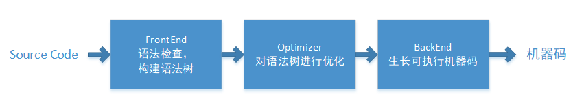

# 编译器开发记录

> by WangYC
>
> @NWPU chang'an 
>
> 参考https://pku-minic.github.io/online-doc/

## 1. 利用docker配置测试环境

Dockerfile:

https://hub.docker.com/layers/compiler-dev/maxxing/compiler-dev/latest/images/sha256-0dd7ee039b8db8e3ba67f23f144e885dc11962aa02ce970c16c13d6be1f15c7c?context=explore

此镜像中提供了RISC-V的测试环境

容器使用方式：

一次性方式：

```
docker run --rm maxxing/compiler-dev ls -l /
```

执行方式：(采用软连接指定可以实现让容器访问宿主机的文件)

```
docker run -it --rm -v /Users/frederickwang/Desktop/projects/compiler/compiler2022:/root/compiler maxxing/compiler-dev bash
```

## 2. IR选择（Koopa IR）

Koopa IR 是一种专为北京大学编译原理课程实践设计的教学用的中间表示 (IR), 它在设计上**类似 LLVM IR, 但简化了很多内容**, 方便大家上手和理解.

Koopa IR 是一种强类型的 IR, IR 中的所有值 (`Value`) 和函数 (`Function`) 都具备类型 (`Type`). 这种设计避免了一些 IR 定义上的模糊之处, 例如之前的教学用 IR 完全不区分整数变量和数组变量, 很容易出现混淆; 同时可以在生成 IR 之前就确定 IR 中存在的部分问题, 例如将任意整数作为内存地址并向其中存储数据.

Koopa IR 中, 基本块 (basic block) 必须是显式定义的. 即, 在描述函数内的指令时, 你必须把指令按照基本块分组, 每个基本块结尾的指令只能是分支/跳转/函数返回指令之一. 在 IR 的数据结构表示上, 指令也会被按照基本块分类. 这很大程度上方便了 IR 的优化, 因为许多优化算法都是在基本块的基础上对程序进行分析/变换的.

Koopa IR 还是一种 SSA 形式的 IR. 虽然这部分内容在课程实践中并非必须掌握, 但考虑到有些同学可能希望在课程实践的要求上, 做出一个更完备, 更强大的编译器, 我们将 Koopa IR 设计成了同时兼容非 SSA 形式和 SSA 形式的样子. 基于 SSA 形式下的 Koopa IR, 你可以开展更多复杂且有效的编译优化.

### LLVM IR：

LLVM：Low-Level Virtual Machine。LLVM项目本意是创建一个虚拟机。创建过程中，创立一个编译高效，占用资源较少的编译平台。从此LLVM代表了编译平台的含义。



LLVM IR 的含义就是针对LLVM平台开发的IR：


LLVM IR有三种形式：

- 内存中的表示形式，如BasicBlock，Instruction这种cpp类；
- bitcode形式，这是一种序列化的二进制表示形式；
- LLVM汇编文件形式，这也是一种序列化的表示形式，与bitcode的区别是汇编文件是可读的、字符串的形式。

详细介绍：https://zhuanlan.zhihu.com/p/200613850

### SSA形式IR：

> In compiler design, static single assignment form (often abbreviated as SSA form or simply SSA) is a property of an intermediate representation (IR), which requires that each variable is assigned exactly once, and every variable is defined before it is used.

SSA 通过简化程序中变量的特性，可以同时达到两种目的：第一，可以简化很多编译优化方法的过程；第二，对很多编译优化方法来说，可以获得更好的优化结果。下面给出一个例子：

```
 y := 1
 y := 2
 x := y
```

SSA形式：

```
 y1 := 1
 y2 := 2
 x1 := y2
```

### Koopa IR执行实例

源码

```objc
// SysY 中的 `putch` 函数的声明.
decl @putch(i32)

// 一个用来输出字符串 (其实是整数数组) 的函数.
// 函数会扫描输入的数组, 将数组中的整数视作 ASCII 码, 并作为字符输出到屏幕上,
// 遇到 0 时停止扫描.
fun @putstr(@arr: *i32) {
%entry:
  jump %loop_entry(@arr)

// Koopa IR 采用基本块参数代替 SSA 形式中的 Phi 函数.
// 当然这部分内容并不在实践要求的必选内容之中, 你无需过分关注.
%loop_entry(%ptr: *i32):
  %cur = load %ptr
  br %cur, %loop_body, %end

%loop_body:
  call @putch(%cur)
  %next = getptr %ptr, 1
  jump %loop_entry(%next)

%end:
  ret
}

// 字符串 "Hello, world!\n\0".
global @str = alloc [i32, 15], {
  72, 101, 108, 108, 111, 44, 32, 119, 111, 114, 108, 100, 33, 10, 0
}

// `main` 函数, 程序的入口.
fun @main(): i32 {
%entry:
  %str = getelemptr @str, 0
  call @putstr(%str)
  ret 0
}

```


## 3. RISC-V

RISC-V, 读作 “risk-five”, 是由加州大学伯克利分校设计并推广的第五代 RISC 指令系统体系结构 (ISA). RISC-V 没有任何历史包袱, 设计简洁, 高效低能耗, 且高度模块化——最主要的, 它还是一款完全开源的 ISA.

RISC-V 的指令系统由基础指令系统 (base instruction set) 和指令系统扩展 (extension) 构成. 每个 RISC-V 处理器必须实现基础指令系统, 同时可以支持若干扩展. 常用的基础指令系统有两种:

- `RV32I`: 32 位整数指令系统.
- `RV64I`: 64 位整数指令系统. 兼容 `RV32I`.

常用的标准指令系统扩展包括:

- `M` 扩展: 包括乘法和除法相关的指令.
- `A` 扩展: 包括原子内存操作相关的指令.
- `F` 扩展: 包括单精度浮点操作相关的指令.
- `D` 扩展: 包括双精度浮点操作相关的指令.
- `C` 扩展: 包括常用指令的 16 位宽度的压缩版本.

我们通常使用 `RV32/64I` + 扩展名称的方式来描述某个处理器/平台支持的 RISC-V 指令系统类型, 例如 `RV32IMA` 代表这个处理器是一个 32 位的, 支持 `M` 和 `A` 扩展的 RISC-V 处理器.

### RISC-V文件编译执行：

源码：

```objc
  # 代码段.
  .text
  # `main` 函数, 程序的入口.
  .globl main
main:
  addi  sp, sp, -16
  sw    ra, 12(sp)
  sw    s0, 8(sp)
  sw    s1, 4(sp)
  la    s0, hello_str
  li    s1, 0
1:
  add   a0, s0, s1
  lbu   a0, 0(a0)
  beqz  a0, 1f
  call  putch
  addi  s1, s1, 1
  j     1b
1:
  li    a0, 0
  lw    s1, 4(sp)
  lw    s0, 8(sp)
  lw    ra, 12(sp)
  addi  sp, sp, 16
  ret

  # 数据段.
  .data
  # 字符串 "Hello, world!\n\0".
hello_str:
  .asciz "Hello, world!\n"

```


## 4. main函数处理

编译器把源代码变成可执行文件的过程 (通常) 又分为:

1. **编译:** 将源代码编译为汇编代码 (assembly).
2. **汇编:** 将汇编代码汇编为目标文件 (object file).
3. **链接:** 将目标文件链接为可执行文件 (execuatble).

我只涉及上述的第一点内容. 也就是, 我们只需要设计一个程序, 将输入的 SysY 源代码, 编译到 RISC-V 汇编即可. 在这种意义之下, 编译器通常由以下几个部分组成:

- **前端:** 通过词法分析和语法分析, 将源代码解析成抽象语法树 (abstract syntax tree, AST). 通过语义分析, 扫描抽象语法树, 检查其是否存在语义错误.
- **中端:** 将抽象语法树转换为中间表示 (intermediate representation, IR), 并在此基础上完成一些机器无关优化.
- **后端:** 将中间表示转换为目标平台的汇编代码, 并在此基础上完成一些机器相关优化.

### 编译器结构

#### 词法分析器lexer

词法分析的作用, 是把字节流转换为单词流 (token stream). 词法分析器 (lexer) 会按照某种规则读取文件, 并将文件的内容拆分成一个个 token 作为输出, 传递给语法分析器 (parser). 同时, lexer 还会忽略文件里的一些无意义的内容, 比如**空格, 换行符和注释**.Lexer 生成的 token 会包含一些信息, 用来让 parser 区分 token 的种类, 以及在必要时获取 token 的内容.

#### 语法分析器parser

Lexer 生成的 token 会包含一些信息, 用来让 parser 区分 token 的种类, 以及在必要时获取 token 的内容.

#### 语义分析

语义分析阶段, 编译器通常会:

- **建立符号表**, 跟踪程序里变量的声明和使用, 确定程序在某处用到了哪一个变量, 同时也可发现变量重复定义/引用未定义变量之类的错误.
- **进行类型检查**, 确定程序中是否存在诸如 “对整数变量进行数组访问” 这种类型问题. 同时标注程序中表达式的类型, 以便进行后续的生成工作. 对于某些编程语言 (例如 C++11 之后的 C++, Rust 等等), 编译器还会进行类型推断.
- **进行必要的编译期计算**. SysY 中支持使用常量表达式作为数组定义时的长度, 而我们在生成 IR 之前, 必须知道数组的长度 (SysY 不支持 [VLA](https://en.wikipedia.org/wiki/Variable-length_array)), 这就要求编译器必须能在编译的时候算出常量表达式的值, 同时对那些无法计算的常量表达式报错. 对于某些支持元编程的语言, 这一步可能会非常复杂.

至此, 我们就能得到一个语法正确, 语义清晰的 AST 表示了.

#### IR生成

编译器通常不会直接通过扫描 AST 来生成目标代码 (汇编)——当然这么做也不是不可以, 因为从定义上讲, AST 也是一种 “中间表示”. 只不过, AST 在形式上更接近源语言, 而且其中可能会包含一些更为高级的语义, 例如分支/循环, 甚至结构体/类等等, 这些内容要一步到位变成汇编还是比较复杂的.

所以, 编译器通常会将 AST 转换为另一种形式的数据结构, 我们把它称作 IR. IR 的抽象层次比 AST 更低, 但又不至于低到汇编代码的程度. 在此基础上, 无论是直接把 IR 进一步转换为汇编代码, 还是在 IR 之上做出一些优化, 都相对更容易.

有了 IR 的存在, 我们也可以大幅降低编译器的开发成本: 假设我们想开发 MM 种语言的编译器, 要求它们能把输入编译成 NN 种指令系统的目标代码, 在没有统一的 IR 的情况下, 我们需要开发 M \times NM×N 个相关模块. 如果我们先把所有源语言都转换到同一种 IR, 然后再将这种 IR 翻译为不同的目标代码, 我们就只需要开发 M + NM+N 个相关模块.

现实世界的确存在这样的操作, 例如 [LLVM IR](https://llvm.org/docs/) 就是一种被广泛使用的 IR. 有很多语言的编译器实现, 例如 Rust, Swift, Julia, 都会将源语言翻译到 LLVM IR. 同时, LLVM IR 可被生成为 x86, ARM, RISC-V 等一系列指令系统的目标代码. 此时, 编译器的前后端是完全解耦的, 两部分可以各自维护, 十分方便.

此外, IR 也可以极大地方便开发者调试自己的编译器. 在编译实践中, 你的编译器对于同一个 SysY 文件的输入, 既可以输出 Koopa IR, 也可以输出 RISC-V. 你可以借助相关测试工具来测试这两部分的正确性, 进而定位你的编译器到底是在前端/中端部分出了问题, 还是在后端的部分出了问题.

当然, 和 token, AST 等数据结构一样, IR 作为编译器内部的一种表示, 其形式也并不是唯一的. 

#### 目标代码生成

编译器进行的最后一步操作, 就是将 IR 转换为目标代码, 也就是目标指令系统的汇编代码. 通常情况下, 这一步通常要做以下几件事:

1. **指令选择:** 决定 IR 中的指令应该被翻译为哪些目标指令系统的指令. 例如前文的 Koopa IR 程序中出现的 `lt` 指令可以被翻译为 RISC-V 中的 `slt`/`slti` 指令.
2. **寄存器分配:** 决定 IR 中的值和指令系统中寄存器的对应关系. 例如前文的 Koopa IR 程序中的 `@x`, `%cond`, `%0` 等等, 它们最终可能会被放在 RISC-V 的某些寄存器中. 由于指令系统中寄存器的数量通常是有限的 (RISC-V 中只有 32 个整数通用寄存器, 且它们并不都能用来存放数据), 某些值还可能会被分配在内存中.
3. **指令调度:** 决定 IR 生成的指令序列最终的顺序如何. 我们通常希望编译器能生成一个最优化的指令序列, 它可以最大程度地利用目标平台的微结构特性, 这样生成的程序的性能就会很高. 例如编译器可能会穿插调度访存指令和其他指令, 以求减少访存导致的停顿.

### 简单编译器实现

#### BENF

EBNF, 即 [Extended Backus–Naur Form](https://en.wikipedia.org/wiki/Extended_Backus–Naur_form), 扩展巴科斯范式, 可以用来描述编程语言的语法. 基于 SysY 的 EBNF, 我们可以从开始符号出发, 推导出任何一个符合 SysY 语法定义的 SysY 程序. 那么, 如何从上述的 EBNF 推导出示例的 SysY 程序呢?

我们不难注意到, EBNF 由若干条形如 `A ::= B;` 的规则构成. 这种规则告诉我们, 当我们遇到一个 `A` 时, 我们可以把 `A` 代换成 `B`, 这就完成了一次推导. 这其中, `A` 被称为非终结符, 因为它可以推导出其他的符号.

#### 开发模版

makefile模版https://github.com/pku-minic/sysy-make-template

#### sysy.l和sysy.y

在模板的 `src` 目录中新建两个文件: `sysy.l` 和 `sysy.y`, 前者将会描述**词法规则**并被 Flex 读取, 后者将会描述**语法规则**并被 Bison 读取. 由于 Flex 和 Bison 生成的 lexer 和 parser 会互相调用, 所以这两个文件里的内容也相互依赖.

`.l`/`.y` 文件有一些共同点, 比如它们的结构都是:

```cpp
// 这里写一些选项, 可以控制 Flex/Bison 的某些行为

%{

// 这里写一些全局的代码
// 因为最后要生成 C/C++ 文件, 实现主要逻辑的部分都是用 C/C++ 写的
// 难免会用到头文件, 所以通常  头文件和一些全局声明/定义  写在这里

%}

// 这里写一些 Flex/Bison 相关的  定义
// 对于 Flex, 这里可以定义某个符号对应的正则表达式
// 对于 Bison, 这里可以定义终结符/非终结符的类型

%%

// 这里写 Flex/Bison 的  规则描述
// 对于 Flex, 这里写的是 lexer 扫描到某个 token 后做的操作
// 对于 Bison, 这里写的是 parser 遇到某种语法规则后做的操作

%%

// 这里写一些用户  自定义的代码
// 比如你希望在生成的 C/C++ 文件里定义一个函数, 做一些辅助工作
// 你同时希望在之前的规则描述里调用你定义的函数
// 那么, 你可以把 C/C++ 的函数定义写在这里, 声明写在文件开头
```

